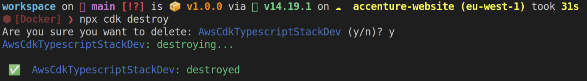

# 101 AWS CDK Typescript - Infinity Works

This is the 101 on AWS CDK written in Typescript, it will introduce you to AWS CDK and some of the features.

CDK allows you to control infrastructure as code in AWS, it allows you to do this in many supported languages.  In this session we will be using Typescript.

CDK Generates Cloudformation, that is then pushed out as stacks in the targetted AWS Account.

AWS keep the CDK up-to-date with latest new products and features, it is a first class citizen in the AWS ecosystem.

## Outline

* How to setup a new project
* Step 1 - Build the project
* Step 2 - Deploy the Stack into AWS
* Step 3 - Improve config and multi environments
* Step 4 - Pass configuration into the stack
* Step 5 - Deploy a lambda
* Step 6 - Give the Lambda access to a DynamoDB table
* Step 7 - Clean up

## How to setup a new project

There is a provided `VSCode Devcontainer` that allows you to run the whole environment in `Docker`.

The versions in this are:

* node v14.19.1
* npm v6.14.16
* awscli v2.6.0
* Python v.3.9.11

```shell
npx cdk init --language=typescript
# Add as a runtime
npm i -D @aws-cdk/aws-lambda-node-js
# ESBUILD
npm i -D esbuild
# SDK
npm i aws-sdk
# Add Typescript
npm i -d typescript
## Bootstrap
npx cdk bootstrap
## Deploy
npx cdk deploy --all
```

The `cdk.json` file tells the CDK Toolkit how to execute your app.

### Useful commands

* `npm run build`   compile typescript to js
* `npm run watch`   watch for changes and compile
* `npm run test`    perform the jest unit tests
* `cdk deploy`      deploy this stack to your default AWS account/region
* `cdk diff`        compare deployed stack with current state
* `cdk synth`       emits the synthesized CloudFormation template

## Step 1 - Build the project

```shell
npm i
export AWS_ENVIRONMENT=DEVELOPMENT
npx cdk synth
```

## Intro

### CDK starting point

The entry point is configured in the [package.json](package.json) file.

Here we can see that the entrypoint will be `bin/aws-cdk-typescript.js`

```json
{
  "name": "aws-cdk-typescript",
  "version": "1.0.0",
  "bin": {
    "101-aws-cdk-typescript": "bin/aws-cdk-typescript.js"
  },
```

### Environmental config & Stack

The starting minimal file in [bin/aws-cdk-typescript.ts](bin/aws-cdk-typescript.ts) looks for the system environment `AWS_ENVIRONMENT` it expects one of three values

* DEVELOPMENT
* TESTING
* PRODUCTION

These environments are designed to be dropped into specific `aws accounts` the expected account number is configured in this file.

Other configuration can be loaded here.

A CDK project can make multiple stacks, in this example we start with a single `Cloudfront Stack` called `AwsCdkTypescriptStack`.

If you look at the lib file [lib/aws-cdk-typescript-empty-stack.ts](lib/aws-cdk-typescript-empty-stack.ts) you can see that this will be an empty stack.

```ts
import { Stack, StackProps } from 'aws-cdk-lib'
import { Construct } from 'constructs'

export class AwsCdkTypescriptStack extends Stack {
    constructor(scope: Construct, id: string, props?: StackProps) {
        super(scope, id, props)
    }
}
```

## Step 2 - Deploy the Stack into AWS

For this step you will need to setup your `AWS CLI` profile using whatever mechanism you have chosen to authenticate.

You should be-able to export a `profile` and then use the standard aws cli to make api calls into your AWS Account.

> This is normally configured in a file in your home directory `~/.aws/config`

```shell
export AWS_PROFILE=name-of-your-profile
aws sts get-caller-identity
```

If this works, you should see the `AWS Role` that is active.

We can now deploy the empty stack with:

```shell
export AWS_ENVIRONMENT=DEVELOPMENT
npx cdk deploy
```

> Tip : You can use the `--rollback=false` to prevent auto rollback in Cloud Formation

Now in the `AWS Console` in the `N.Virginia` region you should see the new Stack `AwsCdkTypescriptStack`

<https://us-east-1.console.aws.amazon.com/cloudformation/home?region=us-east-1#/stacks>


## Step 3 - Improve config and multi environments

We are now going to make the example more useful.

We will enable the different environments to be deployed into a single AWS Account (if required).

We will also add a mechanism for un-secured configuration.

Copy the contents of the [examples/1_config_aws-cdk-typescript.ts](examples/1_config_aws-cdk-typescript.ts) file into [bin/aws-cdk-typescript.ts](bin/aws-cdk-typescript.ts)

The changes in here enable an environment to have a more complex config.

```ts
export interface AppConfig {
    awsAccountNumber: string
    mainRegion: string
    environmentName: string
}
```

The stack name is now `Dynamic` depending on the Environment Name.

```ts
new AwsCdkTypescriptStack(app, `AwsCdkTypescriptStack${currentConfig.environmentName}`, {
    env: { account: currentConfig.awsAccountNumber, region: currentConfig.mainRegion },
})
```

Lets deploy these changes; this will make a new stack called `AwsCdkTypescriptStackDev`

```shell
export AWS_ENVIRONMENT=DEVELOPMENT
npx cdk deploy
```


Now lets delete the first stack we made called `AwsCdkTypescriptStack` in the `AWS Console`

## Step 4 - Pass configuration into the stack

Now we are going to pass this config into the stack.

Copy the contents of the [examples/2_pass_config_aws-cdk-typescript.ts](examples/2_pass_config_aws-cdk-typescript.ts) file into [bin/aws-cdk-typescript.ts](bin/aws-cdk-typescript.ts)

This stack uses a different `lib` file [lib/aws-cdk-typescript-config-stack.ts](lib/aws-cdk-typescript-config-stack.ts)

In this is the code for a custom `StackProps`, this allows us to define what configuration this stack requires.

```ts
export interface CustomStackProps extends StackProps {
    environmentName: string
}

export class AwsCdkTypescriptStack extends Stack {
    constructor(scope: Construct, id: string, props: CustomStackProps) {
        super(scope, id, props)
    }
}
```

So the main code, needs to adhere to this new custom interface:

```ts
new AwsCdkTypescriptStack(app, `AwsCdkTypescriptStack${currentConfig.environmentName}`, {
    env: { account: currentConfig.awsAccountNumber, region: currentConfig.mainRegion },
    environmentName: currentConfig.environmentName,
})
```

Lets deploy these changes:

```shell
export AWS_ENVIRONMENT=DEVELOPMENT
npx cdk deploy
```

This results in `no changes` (which is good)


## Step 5 - Deploy a lambda

This step will actually add an `AWS Lambda` to the stack.

Copy the contents of the [examples/3_add_lambda_aws-cdk-typescript.ts](examples/3_add_lambda_aws-cdk-typescript.ts) file into [bin/aws-cdk-typescript.ts](bin/aws-cdk-typescript.ts)

We can se now that this uses the new [lib/aws-cdk-typescript-lambda-stack.ts](lib/aws-cdk-typescript-lambda-stack.ts).

This code creates a `Lambda` and exposes it using the `Lambda URL` feature.

```ts
const helloWorld = new NodejsFunction(this, 'HelloWorldHandler', {
    runtime: Runtime.NODEJS_14_X,
    entry: join(__dirname, '../', 'lambdas', 'hello-world.ts'),
    depsLockFilePath: join(__dirname, '../', 'lambdas', 'package-lock.json'),
    memorySize: 1024,
    bundling: {
        externalModules: [
            'aws-sdk', // Use the 'aws-sdk' available in the Lambda runtime
        ],
    },
    environment: {
        ENV_NAME : props.environmentName,
    }
})

const helloWorldUrl = new FunctionUrl(this, 'HelloWorldUrl', {
    function: helloWorld,
    authType: FunctionUrlAuthType.NONE,
})
```

CDK builds the lambda from the code in the file [lambdas/hello-world.ts](lambda/hello-world.ts).

This is done using `esbuild`. In the main [package.json](package.json) the `postinstall` script pulls the node_modules down when the main `install` task runs:

```json
  "scripts": {
    "postinstall": "(cd lambdas && npm install);",
    "cdk": "cdk"
  },
```

The CDK passes the Environment name into the Lambda, so it can use this to dynamically write its message.

> note that the Lambda code is using the `AWS SDK` not the `AWS CDK`

```ts
var body = {
    message: `hello ${sourceIp} from ${environmentName}`
}
return {
    statusCode: 200,
    headers: {},
    body: JSON.stringify(body)
}
```

Finally we also output the `Function URL` as a cloudformation output:

```ts
new CfnOutput(this, 'Url', { value: helloWorldUrl.url })
```

Lets deploy these changes:

```shell
export AWS_ENVIRONMENT=DEVELOPMENT
npx cdk deploy
```

> Note you will get asked about some roles that will get created as part of your requested changes


We can see that the newly created Lambda is automatically named after the stack it is in, with some random characters as a suffix
`AwsCdkTypescriptStackDev-HelloWorldHandler30C22324-YxT5RINWVqyW`

If we test this lambda using the lambda test in the AWS Console we get the expected `400 response`


When we hit the URL in a browser we get a nice 200 response (with a JSON payload)

```json
{"message":"hello 109.180.183.211 from Dev"}
```

You can also use the `VSCODE extension` called `humao.rest-client` to make http requests, see [test.http](test.http)

The dynamic parts of the response have been pulled from the `event` object, here is an example event payload:

```json
{
    "version": "2.0",
    "routeKey": "$default",
    "rawPath": "/",
    "rawQueryString": "",
    "headers": {
        "sec-fetch-mode": "navigate",
        "sec-fetch-site": "none",
        "accept-language": "en-GB,en-US;q=0.9,en;q=0.8",
        "x-forwarded-proto": "https",
        "x-forwarded-port": "443",
        "x-forwarded-for": "109.180.183.219",
        "sec-fetch-user": "?1",
        "accept": "text/html,application/xhtml+xml,application/xml;q=0.9,image/avif,image/webp,image/apng,*/*;q=0.8,application/signed-exchange;v=b3;q=0.9",
        "sec-ch-ua": "\" Not A;Brand\";v=\"99\", \"Chromium\";v=\"101\", \"Google Chrome\";v=\"101\"",
        "sec-ch-ua-mobile": "?0",
        "x-amzn-trace-id": "Root=1-62790940-791d9c4f64628ce840aa9da1",
        "sec-ch-ua-platform": "\"Linux\"",
        "host": "gz35gityuve3my64zwqypdfznq0bcuwk.lambda-url.us-east-1.on.aws",
        "upgrade-insecure-requests": "1",
        "cache-control": "max-age=0",
        "accept-encoding": "gzip, deflate, br",
        "sec-fetch-dest": "document",
        "user-agent": "Mozilla/5.0 (X11; Linux x86_64) AppleWebKit/537.36 (KHTML, like Gecko) Chrome/101.0.4951.54 Safari/537.36"
    },
    "requestContext": {
        "accountId": "anonymous",
        "apiId": "gz35gityuve3my64zwqypdfznq0bcuwk",
        "domainName": "gz35gityuve3my64zwqypdfznq0bcuwk.lambda-url.us-east-1.on.aws",
        "domainPrefix": "gz35gityuve3my64zwqypdfznq0bcuwk",
        "http": {
            "method": "GET",
            "path": "/",
            "protocol": "HTTP/1.1",
            "sourceIp": "109.180.183.211",
            "userAgent": "Mozilla/5.0 (X11; Linux x86_64) AppleWebKit/537.36 (KHTML, like Gecko) Chrome/101.0.4951.54 Safari/537.36"
        },
        "requestId": "d382c483-bfff-4f29-9094-7d6e1a427b19",
        "routeKey": "$default",
        "stage": "$default",
        "time": "09/May/2022:12:29:52 +0000",
        "timeEpoch": 1652099392316
    },
    "isBase64Encoded": false
}
```

## Step 6 - Give the Lambda access to a DynamoDB table

In this step we will add a `DynamoDB table` and grant the lambda access to write to it.

CDK makes this very simple, and deals with a lot of the complexity under the hood.

Copy the contents of the [examples/4_add_dynamo_aws-cdk-typescript.ts](examples/4_add_dynamo_aws-cdk-typescript.ts) file into [bin/aws-cdk-typescript.ts](bin/aws-cdk-typescript.ts)

The new lib is [lib/aws-cdk-typescript-lambda-dynamo-stack.ts](lib/aws-cdk-typescript-lambda-dynamo-stack.ts); in this file we can now see that we create a DynamoDB table:

```ts
const table = new Table(this, 'Store', {
    billingMode: BillingMode.PAY_PER_REQUEST,
    removalPolicy: RemovalPolicy.DESTROY,
    partitionKey: {
        name: 'id',
        type: AttributeType.STRING,
    },
    sortKey: {
        name: 'ipAddress',
        type: AttributeType.STRING,
    },
    pointInTimeRecovery: true,
})
```

We pass the `table name` to the lambda as an environment variable named `STORE_TABLE_NAME`:

```ts
environment: {
    ENV_NAME : props.environmentName,
    STORE_TABLE_NAME : table.tableName,
}
```

A new lambda script is being used [lambdas/hello-world-store.ts](lambdas/hello-world-store.ts).

```ts
entry: join(__dirname, '../', 'lambdas', 'hello-world-store.ts'),
```

In this script, when a `POST` is received, it writes a new entry with the requestors IpAddress into the table:

```ts
const params = {
    TableName : storeTableName,
    Item: {
        id: `${uuidv4()}`,
        ipAddress: `${sourceIp}`
    }
}

await docClient.put(params).promise()
```

Finally we then grant the lambda write access to the table:

```ts
table.grantWriteData(helloWorld)
```

Lets deploy these changes:

```shell
export AWS_ENVIRONMENT=DEVELOPMENT
npx cdk deploy
```

During deployment you will get prompted for the extra permissions.


Now we can use the POST example to make the http requests, see [test.http](test.http)

```json
HTTP/1.1 200 OK
Date: Tue, 10 May 2022 12:35:56 GMT
Content-Type: application/json
Content-Length: 92
Connection: close
x-amzn-RequestId: 16743714-3595-4105-b0ee-fd69403c856f
X-Amzn-Trace-Id: root=1-627a5c2b-258ba70a668b14354c7f4aa3;sampled=0

{
  "message": "Stored 109.180.183.219 in AwsCdkTypescriptStackDev-Store1D2A845B-1V2E2S34D0Y6F"
}
```

We can see the new entries appearing in the AWS Console <https://us-east-1.console.aws.amazon.com/dynamodbv2/home?region=us-east-1#tables>


## Step 7 - Clean up

Lets destroy the stack:

```shell
export AWS_ENVIRONMENT=DEVELOPMENT
npx cdk destroy
```


