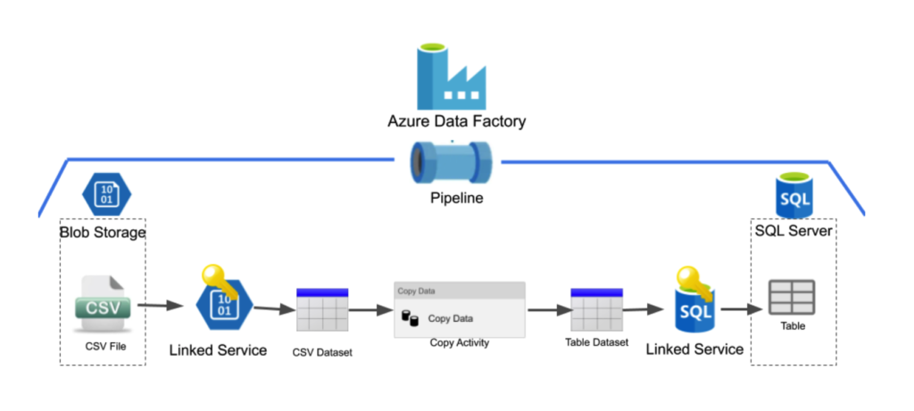
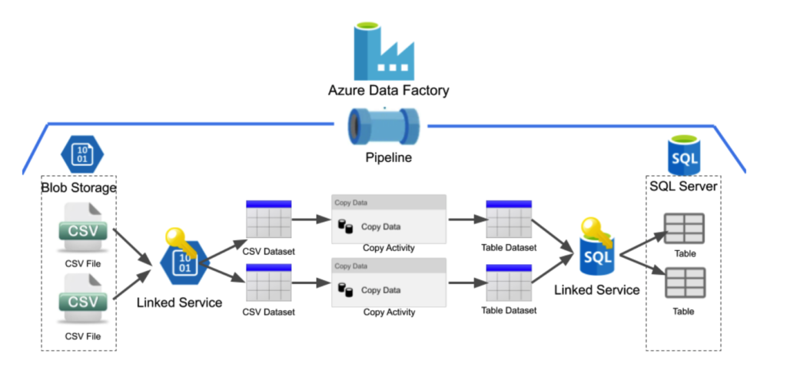
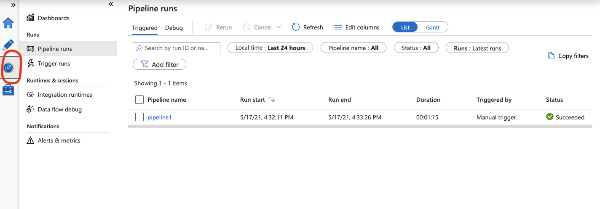

<!-- .slide: data-background="static/a-graphic-colour.svg" data-background-size="contain" data-background-position="bottom right" -->

## Azure 
## Data Factory 101

---

## Overview
- Introduction to Cloud and Azure Data Factory
- How to Build a Basic Data Pipeline
- Monitoring Data Pipelines
- Resolving Common Pipeline Problems 

<aside class="notes">
  This overview covers the rough stages that both parts one and two of the course are going to cover.
</aside>

---

## Learning Objectives
PART 1
- Identify the Key Features of Cloud Computing and Data Factory
- Define the Data Flow for a Basic Data Pipeline
- Create a Basic Pipeline with the Trainer

PART 2
- Create a Basic Pipeline with Less Assistance
- Identify the Features of Data Factory Monitoring
- Monitor Your Pipeline For Successes and Failures
- Resolve Common Pipeline Failures

<aside class="notes">
  If the content for 'Part 2' is being taught on a separate day, remind the learners when it is going to be.
</aside>

---

## Cloud Computing

<aside class="notes">
  Before covering the next couple of slides, elicit from the learners what they already understand cloud computing to be.
</aside>

---

### Cloud Computing

- A computing service that you have access to via the internet
- Cloud providers offer storage, compute, analytics and many other services run by someone else
- The term 'cloud' dates back to the origins of the Internet
- The term 'cloud' is apt because scale of the system behind the service you are accessing is vague

<aside class="notes">
  Can be skipped over if the learners have a solid grasp of what cloud computing is.

  'Cloud' can be traced back to the earliest days of Arpanet, a precursor to the Internet, in the late sixties. They used a cloud symbol on flow charts to refer to the pool of computers that were available over their network.
</aside>

---

### What are the Benefits of Cloud Computing

- Your service can scale with growth and respond to unexpected demand
- Cloud platforms often have a low upfront cost and limited loss if what you are building does not work
- They have good support; someone to call when things go wrong
- They are self-healing, globally distributed and have quick response times

<aside class="notes">
  N/A
</aside>

---

### Microsoft Azure
(as of May 2021)
- The World's Second Largest Cloud Platform
- 20% of Global Cloud Infrastructure Spend is on Azure
- Over 600 services
- Data Factory is a the Part We are Looking at Today

<aside class="notes">
  N/A
</aside>

---

## Azure Data Factory

<aside class="notes">
  N/A
</aside>

---

### What is Data Factory?
- A Tool for Orchestrating and Automating Data Movement and Transformation
- A Complete End-to-End Platform for Data Engineers
- Has a Web-Based UI
- Does Not Require Programming

<aside class="notes">
  Microsoft's own documentation defines Data Factory as a "cloud-based ETL and data integration service that allows you to create data-driven workflows for orchestrating data movement and transforming data at scale. Using Azure Data Factory, you can create and schedule data-driven workflows (called pipelines) that can ingest data from disparate data stores."
</aside>

---

### Core Concepts of Data Factory
- Connecting to Data
* Linked Service<!-- .element: class="fragment" -->
- Defining Data Structures
* Dataset<!-- .element: class="fragment" -->
- Managing and Monitoring Data Movement
* Pipeline<!-- .element: class="fragment" -->
- Defining the Processing Steps in Pipelines
* Activity<!-- .element: class="fragment" -->

<aside class="notes">
  A Linked service can be thought of like a key to unlock access to a particular service or group of data. It defines the connection to a specific data source.

  A dataset is used to represent a data structure which is stored within a data store, such as a database or Blob storage. If they haven't heard of blob, explain that Azure Blob storage is a feature of Microsoft Azure. It allows users to store large amounts of unstructured data on Microsoft's data storage platform. In this case, BLOB stands for Binary Large OBject, which includes objects such as images and multimedia files. 

  A Pipeline is a logical grouping of activities perform a specific task, such as ingesting data from an Azure Blob and then moving it into an SQL database.

  An Activity is a single processing step which performs a task, such as copying data from one place to another or transforming data from one type to another.

  Note: There are other core concepts mention in DF's documentation, but these are the ones applicable to this 101 course.
</aside>

---

### Azure Data Factory Diagram

<!-- .element: class="centered" -->
https://www.productiveedge.com/wp-content/uploads/2020/07/Snip20200727_46-1024x461.png

<aside class="notes">
  The image shows a very simple overview of a factory with one pipeline and contains a source csv and a sink database as well as the linked services, datasets and copy activity within the pipeline.
</aside>

---

#### Emoji Check:

<p style="font-size:128px">
    😀🙂😐🙁😢
</p>

<aside class="notes">
  Ask how everyone is doing
</aside>

---

### Quiz Time! 🤓

---

**Which ONE of These is a Key Benefit of Cloud Computing?**

1. `All of Your Servers are in One Physical Location`
1. `You Pay a Fixed Upfront Fee`
1. `All Cloud Platforms Provide Exactly the Same Services`
1. `Your Service can Scale as Your Business Grows`

Answer: `4`<!-- .element: class="fragment" -->

<aside class="notes">
  N/A
</aside>

---

**Azure Data factory is a cloud-based service for doing which ONE of the following?**

1. `Automating Data Creation and Deletion`
1. `Orchestrating Websites for Data Analytics`
1. `Orchestrating and Automating Data Movement and Transformation`
1. `Automating and Orchestrating Databases`

Answer: `3`<!-- .element: class="fragment" -->

<aside class="notes">
  N/A
</aside>

---

**Which ONE of These is NOT a Core Part of Data Factory?**

1. `Dataset`
1. `Limited Service`
1. `Activity`
1. `Pipeline`

Answer: `2`<!-- .element: class="fragment" -->

<aside class="notes">
  N/A
</aside>

---

## Creating a Pipeline 
## in Data Factory

<aside class="notes">
  Make sure all learners are using Google Chrome or Microsoft Edge, as these are the only two browsers that currently support the Data Factory UI (as of May 2021)

  Microsoft defines a data pipeline in its own documentation as "a logical grouping of activities that together perform a task". In fact https://docs.microsoft.com/en-us/azure/data-factory/ is a great place to get in-depth and up-to-date information on how Data Factory works. This link is in the slide deck at the end of Part 1.
</aside>

---

### Stages of Creating Basic a Pipeline
- Set Up the Environment
- Create Datasets and Linked Services
- Define the Pipeline's Processing Steps

<aside class="notes">
  Explain to the learners that the next section of this lesson will involve a stage of the pipeline being explained, then it will be demonstrated by the instructor and finally carried out by the learners. By the end of this process the learners will have a working data pipeline which, when triggered, will move data from a blob storage into a Snowflake / SQL database.

  Also state that we are going to firstly focus on concepts and then look at how they are actioned using the Azure UI. It is important to have a clear understanding of what we are doing, rather than just which boxes to tick and buttons to click, as the UI is continually evolving and may look different next year.
</aside>

---

## One Extra Step 
#### Creating a New Table in Snowflake

<aside class="notes">
  
</aside>

---

### Creating a New Table in Snowflake
- Select Worksheets to Access SQL console
- Type in these SQL Commands:
```
USE DATABASE NT_ADF_DEMO;
USE SCHEMA USERS;
CREATE TABLE IF NOT EXISTS {{your_table_name}} LIKE users;
```
- You should now have a new, empty table with the same columns as the existing 'users' table
<aside class="notes">
  Explain that using a Snowflake database as the final repository for your data requires a little more work than an standard SQL one in Azure. This slide will take the learners through the stages needed to create a new table in an existing database. The assumption is that all the learners are logged into Snowflake and have the necessary privileges to update the database.
</aside>

---

### Setting Up the Environment
- Create a Data Factory Instance
- Create a New Table in Snowflake
- Create an SQL Database and Server - If Using Azure SQL
- Create a Storage Account
- Upload .CSV Data to a Blob Storage

<aside class="notes">
In this stage you are going to take the learners through each step in the UI before handing over to them to practice what they've seen.

After you have completed each step on your machine, explain that it is their turn to replicate what you have just done. Check as they complete each step that the Azure UI is showing the same resources you have created. Make sure all of the learners have completed a step before moving on to the next.
</aside>

---

### Creating a Data Factory Instance
- Search for Data Factory
- Select and then Add a Data Factory
- Configure the Project and Instance Details
- Choose to Configure Git Later
- Create 

<aside class="notes">
Quickly talk through the stages on the slide just to set the scene for what you are going to be demonstrating.

Explain that all of the resources we are going to create can most easily be found by typing their name into the search bar at the top of the screen. 

Also note that once the 'create' button has been clicked you can start on creating the next resource while this one is still deploying.
</aside>

---

### Creating an SQL Database and Server
#### (If Using Azure SQL - Not needed for Snowflake)
- Search for SQL Database
- Select and then Add an SQL Database
- Add a New Database Server
- Select a Basic Database Option
- Set Networking and Firewall Options
- Create 

<aside class="notes">
NA
</aside>

---

### Creating a Storage Account
- Search for Storage Account
- Select and then Add a Storage Account
- Complete the Basic Project and Instance Details
- Create

<aside class="notes">
This account is needed as it provides all the storage for data objects like blobs, files, tables etc. This storage is then accessible from anywhere in the world using HTTP and HTTPS.
</aside>

---

### Uploading .CSV Data to a Blob Storage
- Select Your Storage Account from All Resources
- Select Containers from the Left-Hand Menu
- Add a Container
- Name the Container and Create
- Select Your New Container
- Upload a .CSV File


<aside class="notes">
This container holds the source data that we are going to move through the pipeline into our new Snowflake table.
</aside>

---

#### Emoji Check:

<p style="font-size:128px">
    😀🙂😐🙁😢
</p>

<aside class="notes">
  Check how the learners feel this first phase went. Do they have any questions about what they have done?
</aside>

---

### Creating Datasets and Linked Services
- Create a Linked Service for the Database
- Create a Dataset for the Database
Using an Alternative Method
- Create a Dataset for the .CSV Data
- Create a Linked Service for the .CSV Data While Creating the Dataset

<aside class="notes">
Same as with the previous stage, you are going to take the learners through each step in the UI before handing over to them to practice what they've seen.

Before beginning the first step, explain that linked services can be created before or while creating dataset. Both examples will be shown.
</aside>

---

### This Stage Uses Your New Data Factory Instance
- From All Resources Select Your Data Factory
  - This Will Open in a New Tab
- Click the Monitoring and Authoring Button
- Select the Pencil Icon from the Left-Hand Menu
- You are Now in the Data Factory UI

<aside class="notes">
Make it clear that All Resources can always be found by going back to the 'Home' page or typing 'All resources' into the search bar.
</aside>

---

### Creating a Linked Service for the CSV Data
- Use the Manage Tab
- Create or Add a Linked Service
- Select Azure Blob Storage, CSV and Continue
- Name the Linked Service
- Generate a SAS Token in Your Storage Account
- Authenticate Using SAS URI Method
- Test Connection and Create

<aside class="notes">
This is the key to unlocking access to the Snowflake database and will be referenced in the Datasets they create for it. 

This is a little tricky as it requires going into your storage account to create a Shared Access Signature (SAS) Token which is then used when the SAS URI Authentication Method is selected.

In the SAS tab in the storage account, select Blob as the Allowed Service and Container and Object as the Allowed Resource types. Then copy the Blob service SAS URL from the bottom of the page. This is what is needed for the SAS URL in the linked service. It contains the SAS Token so you can leave that box blank and Azure will automatically populate it.
</aside>

---

### Creating a Dataset for the .CSV Data

- Add a New Dataset
- Select Azure Blob Storage, CSV and Continue
- Name the Data and Select Your CSV Linked Service
- Test Connection and Create
- Add Path to Data File and Select First Row as Header
- Set Row Delimiter to \r\n

<aside class="notes">
This step defines where the data is going to be stored and the attached linked service provides the access to the storage location. 
</aside>

---

### Creating a Dataset for the Database
#### and adding a Linked Service for the Database While Creating the Dataset
- Return to the Author Tab
- Add a New Dataset and Select Snowflake
- Name the Dataset and Select New Linked Service
- Select Snowflake and Name the Linked Service
- Add Snowflake Login Credentials
- Test Connection and Create
- Select the Table Name and Click OK

<aside class="notes">
This time the learners are going to be creating the linked service while creating the dataset. Both methods are valid.
</aside>

---

#### Emoji Check:

<p style="font-size:128px">
    😀🙂😐🙁😢
</p>

<aside class="notes">
  Check how the learners feel this second phase went. Do they have any questions about what they have done?
</aside>

---

### Defining the Pipeline's Processing Steps 
- Add a Pipeline
- Add a Copy Data Step
- Set the Source and the Sink
- Validate, Debug and Publish
- Trigger and then Check the Database 

<aside class="notes">
  We have all of the components established in the last two stages, so we can go ahead and put all of this together to make our pipeline.

  This will most likely be the shortest stage; unless there are problems with the learners' pipelines.
</aside>

---

### Adding a Pipeline
- Add and Name Your Pipeline
- Drag Copy Data from Move & Transform
- Name Your Copy Data Activity
- Add Your Users Dataset as the Source with Wildcard Path
- Add Your Snowflake Dataset as the Sink 

<aside class="notes">
  N/A
</aside>

---

### Validating, Debugging and Publishing
- In Your Pipeline, Click Validate
- Deal with any Issues that Arise
- Click Debug and Check for Success
- Check Snowflake, in Worksheets:
```
  USE DATABASE {{database_name}};
  USE SCHEMA {{schema_name}};
  SELECT * FROM {{your_table_name}};
  ```
- Error Messages are in the Monitor Tab
- When the Pipeline is Error Free, Click Publish

<aside class="notes">
  In Part 1 we are only looking at this section very briefly just to make the learners aware of it. This will be covered in more depth in the second session where they will actively deal with pipeline issues.

  Validation only checks that all of the required references are setup within the pipeline to make sure it is able to run. It is possible that the pipeline will fail after this, but it will most likely be for a reason that is outside of Azure.

  In the validation step, any issues that appear in the 'Blade' to the right can be clicked on and your focus is moved to the relevant tab in which to resolve the problem.

  Debug does a test run and under normal development conditions is advisable to do this test run using a smaller amount of data so your aren't moving an unnecessarily large amount of data.

</aside>

---

### Triggering the Pipeline
#### and then Checking the Database
- Click Trigger and Select Trigger Now
- Check Your Snowflake Table Again
- In the Worksheets Page
  ```
  USE DATABASE {{database_name}};
  USE SCHEMA {{schema_name}};
  SELECT * FROM {{your_table_name}};
  ```

<aside class="notes">
NA
</aside>

---

#### Emoji Check:

<p style="font-size:128px">
    😀🙂😐🙁😢
</p>

<aside class="notes">
  Check how the learners feel this final phase went. Are their pipelines moving the data as expected? Do they have any questions about what they have done?
</aside>

---

## Further Reading
- https://docs.microsoft.com/en-us/azure/data-factory/

---

## The End of Part 1
#### Congratulations! You can build a data pipeline.<!-- .element: class="fragment" -->

---

<!-- .slide: data-background="static/a-graphic-colour.svg" data-background-size="contain" data-background-position="bottom right" -->

## Azure 
### Data Factory 101

#### Part 2
##### Monitoring and Error Correction

---

## Overview - Recap
- Data Pipeline Practice
- Monitoring
- Common Pipeline Errors 

<aside class="notes">
  N/A
</aside>

---

## Learning Objectives
- Reflect on What was Learnt from Part 1
- Create a Basic Pipeline with Less Assistance
- Identify the Features of Data Factory Monitoring
- Monitor Your Pipeline For Successes and Failures
- Resolve Common Pipeline Failures

<aside class="notes">
  N/A
</aside>

---

### Stages of Pipeline Creation
- Set Up the Environment
- Create Datasets and Linked Services
- Add Pipeline Activities then Validate and Debug

<aside class="notes">
  Explain that the first section of this session is going to involve using the skills learnt in part one to build a slightly more complicated pipeline.

  Don't mention that the creation of this pipeline is going to have faults in it, which will lead into the monitoring and error correction section of the course.
</aside>

---

### Stages of Pipeline Creation
Group Discussion
- You will now be put into small groups in break out rooms
- You will have five minutes to discuss what is required for each of the previously mentioned stages
- Use the provided Jamboard to record key points from your discussion

<aside class="notes">
  Use the breakout room functionality in Google Meet (or whichever video conferencing app you are using) to split the group into smaller groups of three or four. Try to spread out the more knowledgeable learner so they are not all in the same group.

  Give them five minutes in the breakout rooms to discuss what they remember from Part 1 for each of the stages of Data Pipeline Creation in Data Factory. If you have access to Google Jamboard, this is a good way for each group to visually record what they are discussing and this is particularly useful for feedback after this activity.
</aside>

---

#### Emoji Check:

<p style="font-size:128px">
    😀🙂😐🙁😢
</p>

<aside class="notes">
  Ask how everyone is doing
</aside>

---

### Quiz Time! 🤓

---

**When Creating a Resource in Azure, How do we Know that We haven't Provided Enough Information?**

1. `It Pops Up with an Alert Box`
1. `The Review + Create Tab Displays a 'Validation Failed' Error`
1. `When We Try to Use the Resource Later, Azure Throws an Error`
1. `You Receive an Email to the Account You Sign In to Azure With`

Answer: `2`<!-- .element: class="fragment" -->

<aside class="notes">
  If everything is OK, the message at the top of the 'Review + Create' tab
</aside>

---

**What Resource Do We Need to Create so We can Make Data Available for Access within Azure?**

1. `CSV File`
1. `Linked Service`
1. `Azure Blob`
1. `Storage Account`

Answer: `4`<!-- .element: class="fragment" -->

<aside class="notes">
  The Azure Blob can contain a CSV File, and a Linked Service is needed to unlock access it, but it is the Storage Account which provides accessibility to the data you are storing.
</aside>

---

**After selecting a Data Factory from Your List of Resources, which Button do You Click to Make the Data Factory UI Open in Another Tab?**

1. `Author & Monitor`
1. `Manage`
1. `Data Factory Launch`
1. `Home`

Answer: `1`<!-- .element: class="fragment" -->

<aside class="notes">
  N/A
</aside>

---

**When creating a Linked Service for an Azure Blob Storage, Which Authentication Method do We Need to Use to Make it Compatible with ADF and Snowflake?**

1. `Account Key`
1. `SAS URI`
1. `Service Principal`
1. `Managed Identity`

Answer: `2`<!-- .element: class="fragment" -->

<aside class="notes">
  These are all of the potential options for an Authentication Method, but we have to use SAS (Shared Access Signature) when moving data to Snowflake. The required SAS URL can be created from the 'Security and Networking' section of your Storage Account menu.
</aside>

---

## Building a New Data Pipeline

<aside class="notes">
  The learners are now going to work individually, or in pairs, to create the resources needed for a new data pipeline.
</aside>

---

### Azure Data Factory Diagram

<!-- .element: class="centered" -->
https://www.productiveedge.com/wp-content/uploads/2020/07/Snip20200727_47-1024x482.png

<aside class="notes">
  The image shows a very simple overview of a factory with one pipeline and contains a source csv and a sink database as well as the linked services, datasets and copy activity within the pipeline.
</aside>

---

### Set Up the Environment
Using what you learnt in part 1
- Add New USERS and LOCATIONS Snowflake Tables Using the STAGING Schema
- Create a Data Factory
- Create a Storage Account
- Add Users Source System Data to an Azure Blob Storage Container 
- Add Location Source System Data to an Azure Blob Storage Container

<aside class="notes">
  This is very similar to what they did in part one but they need two tables in the database and two containers in the storage account in which to put the `.csv` data files.
</aside>

---

#### Emoji Check:

<p style="font-size:128px">
    😀🙂😐🙁😢
</p>

<aside class="notes">
  Ask how everyone is doing
</aside>

---

### Create Datasets and Linked Services
Using what you learnt in part 1
- Add a Linked Service to Your Azure Blob Storage
- Create a Dataset for the Users Blob
- Create a Dataset for the Locations Blob
- Add a Linked Service to the Snowflake Database
- Create a Dataset for the Users Table
- Create a Dataset for the Locations Table

<aside class="notes">
  Remind the learners what they saw earlier in the diagram; this time they can use a single linked service because both `.csv` files are stored in containers which reside within the same Blob Storage. Likewise, they only need to create one linked service for Snowflake because both tables where the `csv` data is going are in the same database. 

  However, they will still need to create separate datasets for the users data, the locations data, the users table and the locations table. Remind them that the datasets specifically reference each of the `.csv` files that are stored in their respective containers. This will be particularly relevant when they come to resolve the errors later in the session.
</aside>

---

#### Emoji Check:

<p style="font-size:128px">
    😀🙂😐🙁😢
</p>

<aside class="notes">
  Ask how everyone is doing
</aside>

---

### Setup the Pipeline and Activities
Using what you learnt in part 1
- Create a Pipeline
- Add a Copy Data Activity for the Users
- Add a Copy Data Activity for the Locations
- Validate the Pipeline

---

#### Emoji Check:

<p style="font-size:128px">
    😀🙂😐🙁😢
</p>

<aside class="notes">
  Ask how everyone is doing
</aside>

---

### Move the Data
Using what you learnt in part 1

*-* Debug the Pipeline

*-* What Happened?<!-- .element: class="fragment" -->

*-* "Azure, We Have a Problem"<!-- .element: class="fragment" -->

<aside class="notes">
  After running the Debug test run they will all notice that their pipeline has failed. Ask the learners where they think they can find information the will help them track down the error.

  If they are not sure, move on to the slide after next and remind them of the monitoring page, which can be accessed from Data Factory's left-hand menu.

  Although the error log that Data Factory produces isn't as helpful as they would probably expect, it should be enough to help them identify that the problem is to do with a .CSV file in their blob storage. 
</aside>

---

## Monitoring and Error Correction

---

### Data Factory's Monitoring Tab

<!-- .element: class="centered" -->


<aside class="notes">
  Mention that the circled icon in the picture allows access to the monitoring whenever you are in Data Factory.

  Draw their attention to the Triggered and Debug tabs near the top. 
</aside>

---

### Identifying and Correcting Errors

We are going to track down and rectify the problem(s) which made your pipeline fail.
- Use the Debug button on the monitoring page to find the information relating to your most recent test run.
- Look for the error column and click the speech bubble icon relating to your test run.
- You may need to expand the pop-up box to more easily read the message.
- What does the message indicate that is useful to help track down the problem?
- Where do we need to look to rectify the issue?

<aside class="notes">
  This area can always be accessed from the left-hand menu in Data Factory.
</aside>

---

### Error 1

What caused the error?

*-* The member_id column was missing from the `.csv` file and the database table has that column.<!-- .element: class="fragment" -->

What do we need to do to fix it?

*-* Get a new `.csv` file with the error corrected?<!-- .element: class="fragment" -->

*-* Where do we need to look in Azure Data Factory to correct the issue?<!-- .element: class="fragment" -->

<aside class="notes">
  Elicit answers from learners. When they have identified that the error occurred because of an incorrect data type and that a new .csv file with the error corrected will be needed, tell them that the "person / department" responsible is sorry for the error and is going to provide them with the updated version of the file. This file will create error number two, but don't tell them that.
</aside>

---

### Error 2

What caused this error?

*-* The member_id column in the database only accepts numbers. One piece of data in the `.csv` file for this column was a STRING.<!-- .element: class="fragment" -->

What do we need to do to fix it?

*-* Edit the `.csv` file?<!-- .element: class="fragment" -->

*-* Get a new `.csv` file with the error corrected?<!-- .element: class="fragment" -->

*-* Where do we need to look in Azure Data Factory to correct the issue?<!-- .element: class="fragment" -->

<aside class="notes">
  Elicit answers from learners. When they have identified that the error occurred because of an incorrect data type and that a new .csv file with the error corrected will be needed, tell them that the "person / department" responsible for the error is REALLY sorry this time and promises that the new file they are providing is correct. It actually is this time and the pipeline will pass the debug test, but there is another issue they will encounter when they check their database tables.
</aside>

---

### Success???

Did it work this time?

*-* YES!! Both copy activities have registered the green tick of success<!-- .element: class="fragment" -->

Are there any more errors or issues?

*-* Something wrong with the data in the Users table in Snowflake<!-- .element: class="fragment" -->

*-* How can we correct this?<!-- .element: class="fragment" -->

*-* A short pre-copy script should do the trick, but where do we write it?<!-- .element: class="fragment" -->

<aside class="notes">
  N/A
</aside>

---

### Error 3 - Data Duplication

How can we correct this?

*-* A short pre-copy script should do the trick<!-- .element: class="fragment" -->

*-* ...but what do we write?<!-- .element: class="fragment" -->

*-* ```
    TRUNCATE TABLE {{schema}}.{{your_table_name}};
    ```<!-- .element: class="fragment" -->

*-* ...and where do we write it?<!-- .element: class="fragment" -->


<aside class="notes">
  N/A
</aside>

---

#### Emoji Check:

<p style="font-size:128px">
    😀🙂😐🙁😢
</p>

<aside class="notes">
  Ask how everyone is doing
</aside>

---

## The End of Part 2
#### Congratulations!!! You are all data engineers.<!-- .element: class="fragment" -->
