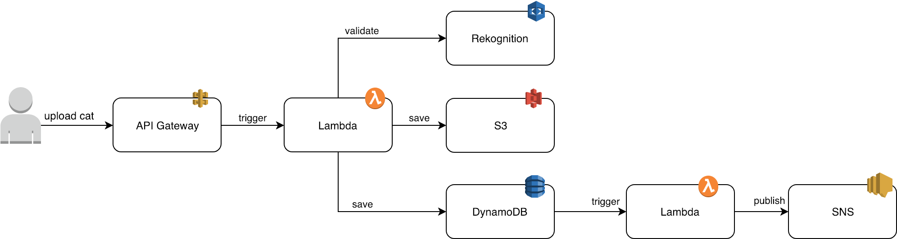

# Serverless 103 

The greedy-cats folder contains a sample Serverless application we are going to add more serverless features to. 

## Architecture



## Setup

Install Node modules:

```
$ npm install
```

Install Serverless plugins:

```
$ sls plugin install --name serverless-s3-sync
$ sls plugin install --name serverless-pseudo-parameters
```

Deploy stack:

Before deploy we needed to change the S3 bucket names (add a random string to the end) both ```cats-app-static-bucket-3``` and ```cats-app-image-bucket-3```because the names are global, 

otherwise we will get this error "An error occurred: StaticSite - cats-app-static-bucket-3 already exists."

Either do a global find and replace  or edit the below lines to all be the same name: (file : linenumber)
```
cats-app-static-bucket-3 (2 occurences accross 1 file):
  serverless.yml : 46
  serverless.yml : 57
cats-app-image-bucket-3 (6 occurences accross 2 files):
  serverless.yml : 16
  serverless.yml : 20
  serverless.yml : 42 
  cats.js : 7
  cats.js : 16
  cats.js : 26
```

After we have edited the bucket names we can deploy


```
$ sls deploy --aws-profile=changeme
```

## Task 0 - Bonus from last week: Image Validation

1) Update IAM role to allow access to AWS Rekognition
2) Refactor PUT handler to call validator before saving image

In `serverless.yml` edit the `iamRoleStatements` section and add:

```yaml
- Effect: "Allow"
  Action:
    - rekognition:DetectLabels
  Resource: "*"
```

Refactor `app.js` to include the following snippet: 

```js
cats.validateImage(fileData)
 .then(result => result===true ? null : Promise.reject('Image is not a cat! It\'s a '+result))
 .then(() => cats.putImage(fileName, fileData))
 .then(() => res.redirect(req.header('Referer')))
 .catch(err => res.status(400).send(err.toString()));
```

## Task 1 - DynamoDB

1) Define new resource in `serverless.yml`
2) Update Lambda IAM role allow write access to DynamoDB
3) Update `putImage` method to save upload details

Create resource:

```yaml
UploadHistory:
  Type: AWS::DynamoDB::Table
  Properties:
    TableName: "UploadHistory"
    AttributeDefinitions: 
      - 
        AttributeName: "created"
        AttributeType: "S"
      - 
        AttributeName: "requestId"
        AttributeType: "S"
    KeySchema: 
      - 
        AttributeName: "created"
        KeyType: "HASH"
      - 
        AttributeName: "requestId"
        KeyType: "RANGE"
    ProvisionedThroughput: 
      ReadCapacityUnits: "1"
      WriteCapacityUnits: "1"
```

Update IAM role:

```yaml
- Effect: "Allow"
  Action: 
    - dynamodb:PutItem
  Resource: "arn:aws:dynamodb:#{AWS::Region}:#{AWS::AccountId}:table/UploadHistory"
```

Modify `putImage` function in `cats.js`:

```javascript
.then(result => {
  var dynamoDB = new AWS.DynamoDB();
  var d = new Date();
  return dynamoDB.putItem({
    TableName: 'UploadHistory',
    Item: {
      created: {
        S: d.toISOString()
      },
      requestId: {
        S: filename
      },
    }
  }).promise();
});
```

Deploy function update and the new resource:

```
$ sls deploy --aws-profile xxx
```

## Task 2 - Notifications

1) Create notification stream for DynamoDB table
2) Subscribe to events with a new lambda

Add the following to our UploadHistory resource:

```yaml
StreamSpecification:
  StreamViewType: "NEW_IMAGE"
```

The function is already included it just needs to be hooked up in the functions section:

```yaml
requestPayment:
  handler: cats.requestPayment
  events:
    - stream:
        type: dynamodb
        arn:
          Fn::GetAtt: [ UploadHistory, StreamArn ]
```

We also needs to add a few more actions to our IAM role we created earlier:

```yaml
- dynamodb:GetRecords
- dynamodb:GetShardIterator
- dynamodb:DescribeStream
```