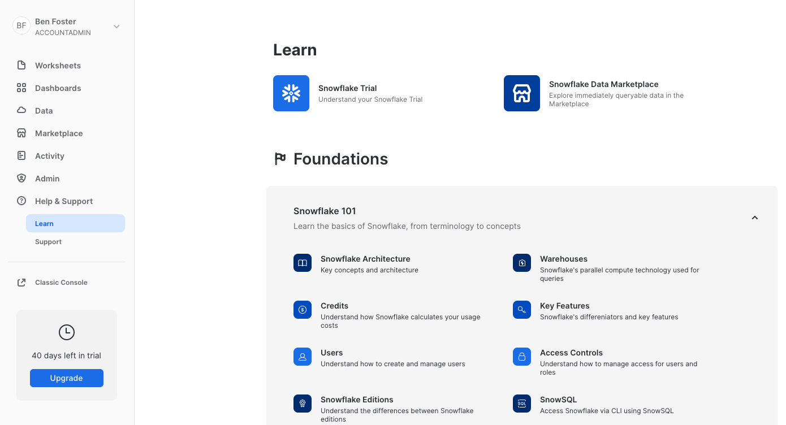

# Creating a Snowflake account

## Sign up
Open a browser and navigate to the [Snowflake homepage](https://www.snowflake.com/) and select `Start For Free`.

You'll need to enter the following details to set up a Snowflake account.

- Name, Email address, Title, Company, Country

Account type:
- Snowflake edition (tier): Snowflake offers multiple tiers depending on the features you require `Recommended: Enterprise for multi-cluster compute and other features`
- Cloud platform: This isn't your cloud account but under-the-hood where your Snowflake account will be hosted `Recommended: AWS`
- Region: This parameter is independent of the region your external cloud account uses. `Recommended: Ireland (eu-west-1)`

## Activate your account

Once you have entered your details, you should recieve an email with a confirmation link to access your account.

The user details you enter will be the default account admin, name this appropriately and after initial account set up and RBAC implementation, lock this user away for emergencies or infrequent access.

You should enter the console and see the following:

