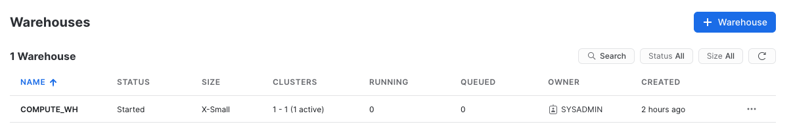

# A quick tour of the UI

The "modern" Snowflake UI is called Snowsight, and more details about it can be found [here](https://docs.snowflake.com/en/user-guide/ui-snowsight.html)

## The main menu

The menu to the left allows you to switch between the different areas of Snowflake.

Areas:
* Worksheets
* Dashboards
* Data
* Marketplace
* Activity
* Admin
* Help & Support

## Worksheets

Provides an interface for submitting SQL queries, performing DDL and DML operations and viewing results as your queries/operations complete.

Each worksheet has it's own "context" which defines which role, warehouse, database, and schema your queries will be run inside. This allows you to have multiple worksheets simultaneously with different config. This differs from the account context (top right) which determines which items appear in the top menu and what function you are allowed to run in the UI outside of the worksheet context.

Worksheets are saved automatically each time you change the content and will be persisted in your account until you explicily remove them.

## Dashboards

Allows you to create dashboards visualising the data within your Snowflake Databases all inside the same ecosystem, without reliance on external tooling and integrations.

## Data

### Databases

Shows information about the databases you have created or have privileges to access. You can create, clone, drop, or transfer ownership of databases as well as load data (limited) in the UI.

### Private Sharing
Allows data sharing to be configured to easily and securely share Snowflake table(s) among separate Snowflake accounts or external users.

## Marketplace

Allows you to import pre-made data sets curated by external companies.

## Activity

### Query History

Allows you to view the details of all queries executed in the last 14 days in the Snowflake account.

## Admin

This area allows you to administer your Snowflake account, from configuring Users and Roles to Warehouses, and also monitor the usage of your resources

### Warehouses

This is where you set up and manage compute resources (virtual warehouses) to load or query data in Snowflake.

## Help & Support

This area provides access to some quickstart tutorials on how to get up and running quickly with your trial account. If you connect a payment card to your account it also allows you to contact Snowflake support.