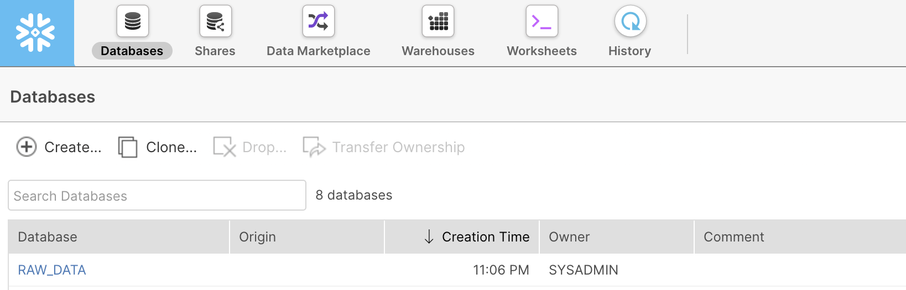
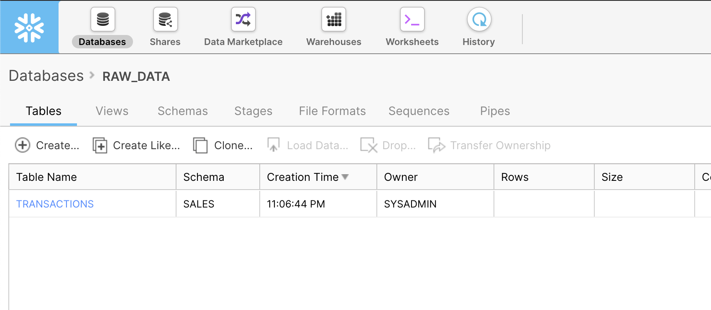
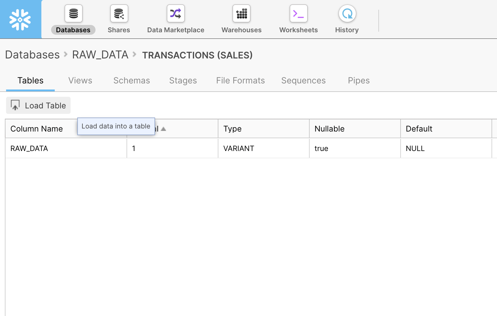
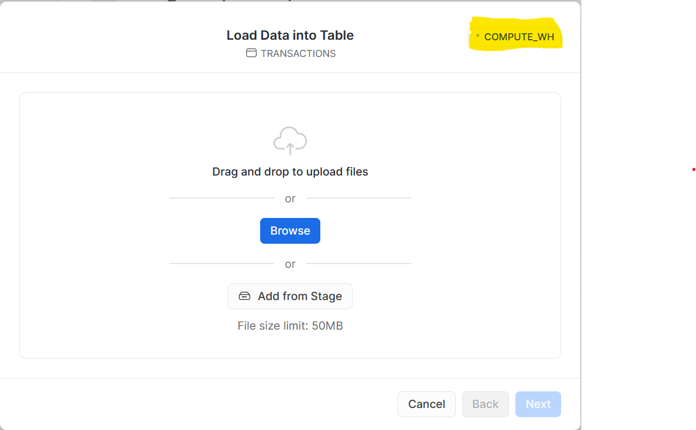
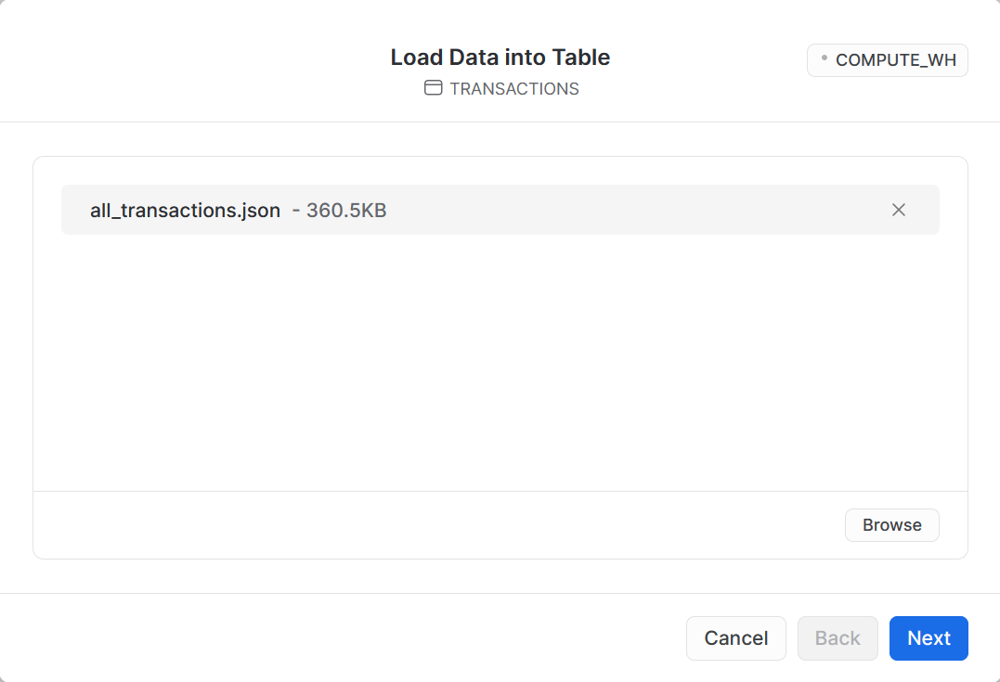
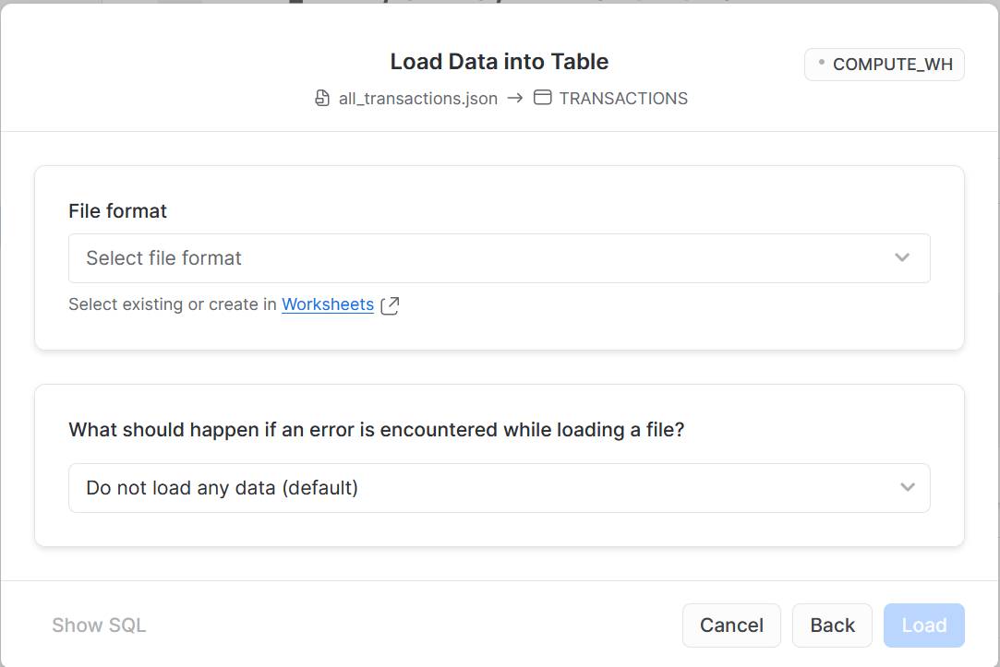
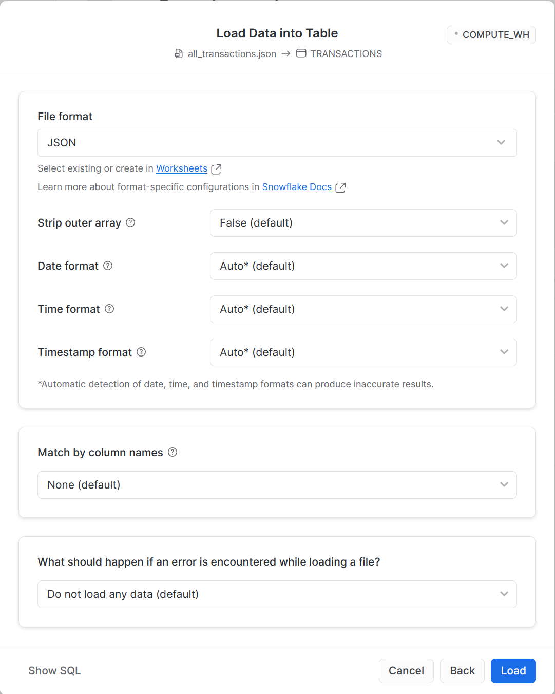
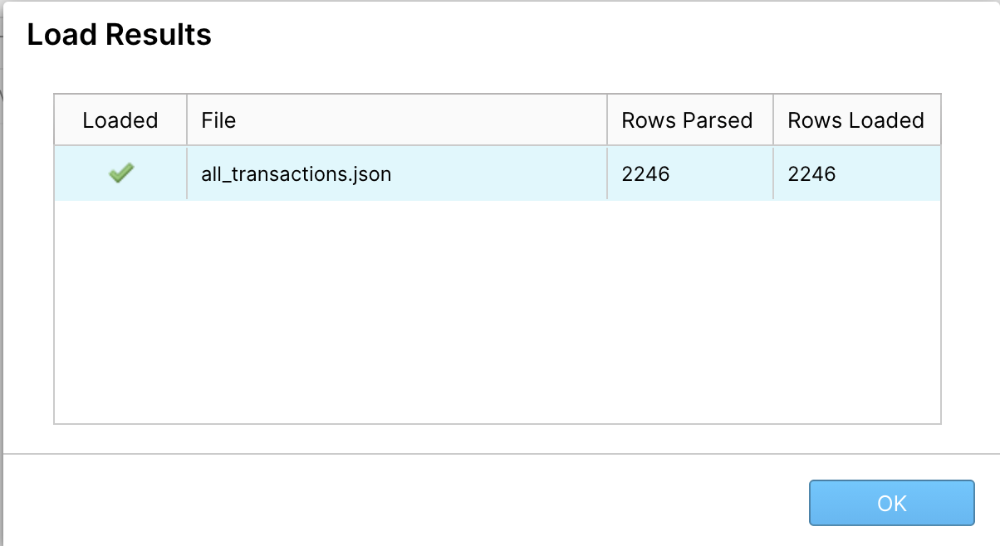

# Loading data via the Snowflake UI [[docs](https://docs.snowflake.com/en/user-guide/data-load-web-ui.html)]


## The Snowflake Load Data Wizard

To load ad-hoc files into Snowflake, we can use the Snowflake Load Data Wizard which is part of the Snowflake UI. In the _real world_, you would usually build a data pipeline to automate this but the Load Data Wizard is a great way to easily import data while you are developing and testing new functionality for your data warehouse.

To load data into the transactions table, we can use Snowflake's built-in table stage. A stage is a temporary holding area for data which we'll use to load our files into Snowflake. We don't need to dive too deep into stages at this stage but for the curious, further reading can be found [here](https://docs.snowflake.com/en/user-guide/data-load-local-file-system-create-stage.html).

## Getting the data

Sample transaction data has been provided in a public S3 bucket `generation-snowflake-day` based on shopping baskets for a supermarket.


### Transactions files

To download the files, you have a couple of options:

Via your web browser:

Visit https://generation-snowflake-day.s3.eu-west-2.amazonaws.com/all_transactions.json and save the file/page to your local disk.

In your terminal using `curl`:

```curl https://generation-snowflake-day.s3.eu-west-2.amazonaws.com/all_transactions.json -o all_transactions.json```

## Loading data via the console UI

To load data via the console, navigate to the databases tab.



### Select the table you wish to upload data into.



### Click on Load Table.



You'll now be taken through a series of options regarding the Warehouse (compute) utilised for the load, and selecting the file format of your data.


### Select your warehouses



### Choose your files to upload



### Select the required file format



At this point you must create a `FILE FORMAT` which defines your data; we can create one using this wizard - click on the `+` icon to begin.

## File formats [[docs](https://docs.snowflake.com/en/sql-reference/sql/show-file-formats.html)]

File formats are used to define custom data structures, whether that be unstructured JSON or relational CSV data; they instruct Snowflake how to read and handle the data you wish to upload. File formats belong to a database and schema. A file format can receive instructions including if the file is compressed or not, the encoding, whether the CSV file has a header row (column names), and how Snowflake handles errors when it recieves bad data.

Let's continue with the wizard.



Our data is JSON so select the `Format Type` as JSON and enter the name as `TRANSACTIONS_JSON`. Click `Finish` once you have filled these two fields. This file format resource will be available in the PUBLIC schema of our database by default, and the default settings will detect if the file is compressed upon loading from the stage.

Once you have created the `FILE_FORMAT` and clicked `Finish`, it should automatically populate the File Format box with your new Format. Click load to load the data into your `TRANSACTIONS` table.



You can now navigate back to a worksheet and run queries on the data.


To retrieve all existing file formats run:

```SHOW FILE FORMATS;```
