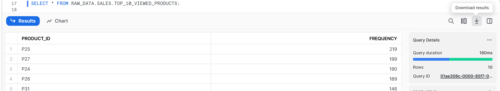
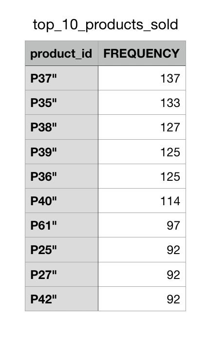

# Downloading (unloading) data from Snowflake [[docs](https://docs.snowflake.com/en/user-guide-data-unload.html)]

Now you have some interesting insights you might want to share your findings with your team and stakeholders. If they don't have direct access to Snowflake, we'll need to export it into a common format.

There are a number of ways to export data (for non-technical people, being able to query a SQL data warehouse isn't much use); one could use the programmatic connectors (Python, Go, Node.js etc.), the SnowSQL CLI, visualisation tools with native Snowflake support (AWS QuickSight, Tableau, Microsoft Power BI), or by using the `COPY INTO` command in the opposite direction to copy from Snowflake to S3 or other blob storage. The simplest method when doing ad-hoc development is to export via the web UI after running your query.

## Exporting data from query results

Let's start by querying the view we made:

    SELECT * FROM RAW_DATA.SALES.TOP_10_VIEWED_PRODUCTS;

Next, hit the `Download results` button.

You'll be presented with a few options to decide the delimiter (what separates the columns in the file) and file name. One of the most common file formats to consume is a `.csv`; this can be opened by a vast number of applications, including Microsoft Excel.

There is a specific option for `.csv for Excel` which, at the time of writing (August 2023), seems to simply add an extra blank line at the top of the file. So for now, stick to the plain `.csv` or `.tsv`. This may change in the future, if you're having trouble loading certain `.csv` files into Excel, give the `.csv for Excel` option a go.

Congratulations, you've exported your data!

