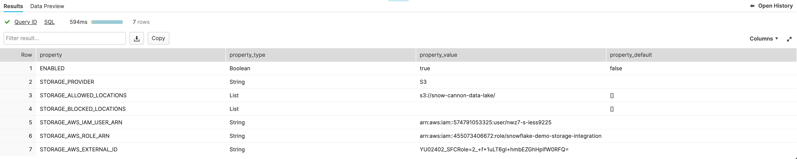

# Getting data into Snowflake from AWS S3

A snowflake account has in-built capabilities connected to an external cloud account (AWS S3, Azure Blob Storage, Google Cloud Storage) to consume data from or send data to.

Unlike importing data directly into a table using the Data Import Wizard, we require a Stage. This stage will also need a supporting resource; a `Storage Integration` with the source bucket details and optionally, an authentication resource - in the case of AWS, an `IAM role` or `Access Key ID`/`Secret Access Key` pair.

## Storage Integrations [[docs](https://docs.snowflake.com/en/sql-reference/sql/create-storage-integration.html)]

A storage integration forms the bridge between Snowflake and your AWS account, and contains the configuration required (storage provider, authentication etc.) to access resources like S3. The integration must be created by the ACCOUNTADMIN and any resources that depend on it must also be created by the ACCOUNTADMIN role.

As we are accessing a public S3 bucket, we don't need to provide any authentication details so we don't need to create a STORAGE INTEGRATION for this example.

You can see the details of Storage Integrations by running the following command:

```DESC INTEGRATION <integration-name>```



## External Stage [[docs](https://docs.snowflake.com/en/user-guide/data-load-s3-create-stage.html#external-stages)]

An External Stage is used to "look" into the bucket, this relies on the Storage Integration that we have just created. The stage must be created within a database and schema. A stage can be a bucket but also just a subfolder of a bucket.

```
USE ROLE ACCOUNTADMIN;
USE DATABASE RAW_DATA;
USE SCHEMA SALES;

CREATE OR REPLACE STAGE TRANSACTIONS_EXTERNAL_STAGE
    URL = 's3://snowflake-101/';
```

# List the contents of the stage

Once the you have created your External Stage, check you can see the files in the stage by running:

```LIST @TRANSACTIONS_EXTERNAL_STAGE;```

Once you have confirmed that you can access the source files, the next step is to load the data from S3 into your table.

The first step is to TRUNCATE your existing table from the previous exercise to ensure you don't end up with duplicated data.

```
TRUNCATE TABLE RAW_DATA.SALES.TRANSACTIONS;
```

We're now ready to load data into Snowflake. Instaed of using the Data Load Wizard, we can now reference data directly from S3 via SQL commands. The COPY INTO command copies the data from our files in S3 into our Snowflake table:

```
COPY INTO 
    RAW_DATA.SALES.TRANSACTIONS
FROM
    @TRANSACTIONS_EXTERNAL_STAGE/all_transactions.json
    FILE_FORMAT = RAW_DATA.PUBLIC.TRANSACTIONS_JSON
    ON_ERROR = 'skip_file';
```

You can now query the data ingested from S3 using:

```SELECT * FROM RAW_DATA.SALES.TRANSACTIONS```
