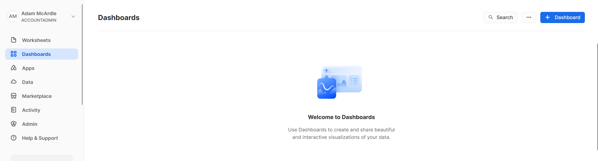
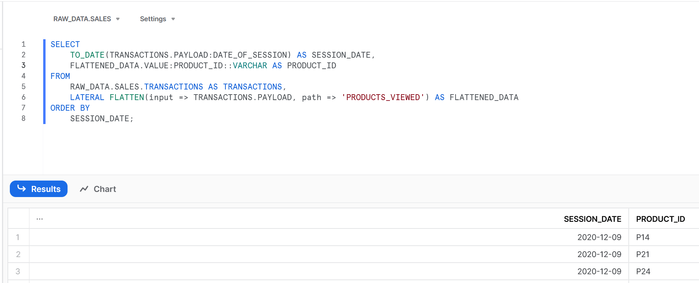
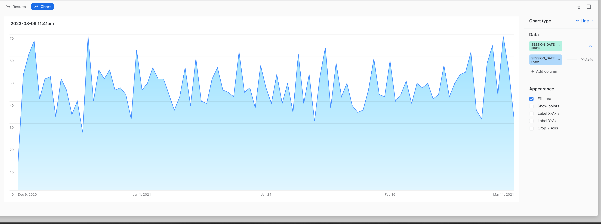
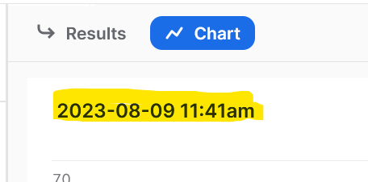
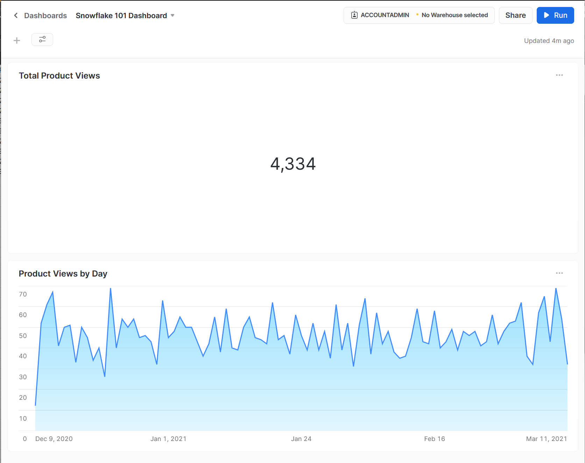
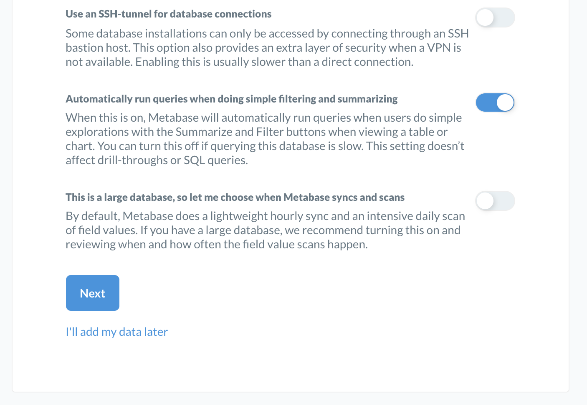
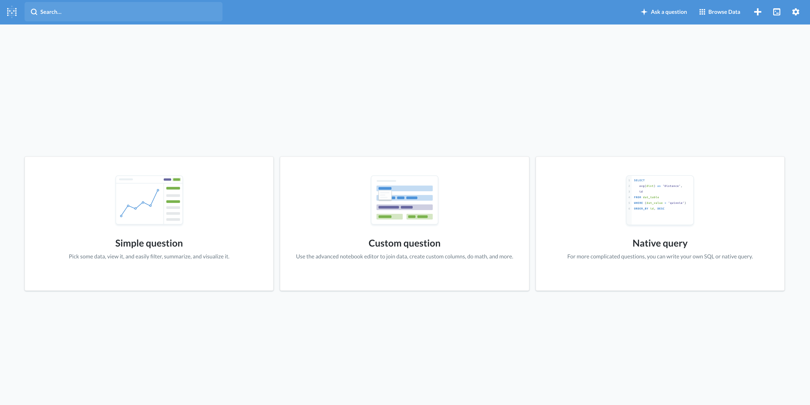

# Connecting analytics dashboards

One of the most powerful uses of a data warehouse is to give others the ability to go fish for themselves. We want to empower people to run their own analysis and create reports, rather than relying on engineers to make these things.

## Dashboards in Snowflake
Snowflake has some basic dashboarding functionality built in. To use this, go back to the main menu. If you are in a worksheet, you will need to click the `< Worksheets` button in the top-left hand corner to get to the main menu. Once there, click `Dashboards`

Click the `+ Dashboard` button in the top-right, give your dashboard a name and click Create Dashboard.

Click the `New Tile` button and select `From SQL Worksheet`

Paste in this query and run it:

    SELECT
        TO_DATE(TRANSACTIONS.PAYLOAD:DATE_OF_SESSION) AS SESSION_DATE,
        FLATTENED_DATA.VALUE:PRODUCT_ID::VARCHAR AS PRODUCT_ID
    FROM
        RAW_DATA.SALES.TRANSACTIONS AS TRANSACTIONS,
        LATERAL FLATTEN(input => TRANSACTIONS.PAYLOAD, path => 'PRODUCTS_VIEWED') AS FLATTENED_DATA
    ORDER BY
        SESSION_DATE;

This will give us the results we're used to, so now click the Chart button

On the right hand side you can configure your chart's options, but we'll just keep the defaults. 

This shows us a line chart, orderd by date and showing how many products were viewed on each day. To give your chart a title, click the highlighted part under the `Chart` button, and type in a better name.

Click the `- Return to {your dashboard name}` button in the top left hand corner and you can see that your chart has been added. You could add other tiles to your dashboard using different queries, such as a Total Product Views tile using this query, set the Chart Type to `Scorecard`

    SELECT
        COUNT(FLATTENED_DATA.VALUE:PRODUCT_ID::VARCHAR) AS TOTAL_PRODUCT_VIEWS
    FROM
        RAW_DATA.SALES.TRANSACTIONS AS TRANSACTIONS,
        LATERAL FLATTEN(input => TRANSACTIONS.PAYLOAD, path => 'PRODUCTS_VIEWED') AS FLATTENED_DATA

The completed dashboard:

## Dashboards in Other Tools

For this section, you will require docker.

The dashboards available in Snowflake are somewhat limited, so you will probably find you want to use a dedicated data visualisation tool. Some examples are:
 - Power BI
 - Tableau
 - Metabase
 
 As a simple 'up and running' example, we will use Docker to run a dashboard which is accessible from our localhost in browser.

In this example we will use Metabase; it is a simple, open source analytics platform which can be run out of a container. If you wish to productionize it, you can use services like AWS Elastic Beanstalk.

Follow the instructions on the Metabase page [here](https://www.metabase.com/docs/latest/operations-guide/running-metabase-on-docker.html).

By and large all you need to do is run the following command which will pull and load the image:

    docker run -d -p 3000:3000 --name metabase metabase/metabase

Then once it has instantiated, open your browser and enter:

     localhost:3000

 The following show the expected steps to create an account and run a query:

 

 

 

 

 

 

 

 Run a query:

      SELECT FLATTENED_DATA.VALUE:PRODUCT_ID::VARCHAR AS PRODUCT_ID,
          SUM(1) AS FREQUENCY
      FROM RAW_DATA.SALES.TRANSACTIONS AS TRANSACTIONS,
          LATERAL FLATTEN(input => TRANSACTIONS.PAYLOAD, path => 'PRODUCTS_VIEWED') AS FLATTENED_DATA
      GROUP BY FLATTENED_DATA.VALUE:PRODUCT_ID
      ORDER BY FREQUENCY DESC
      
 

 
