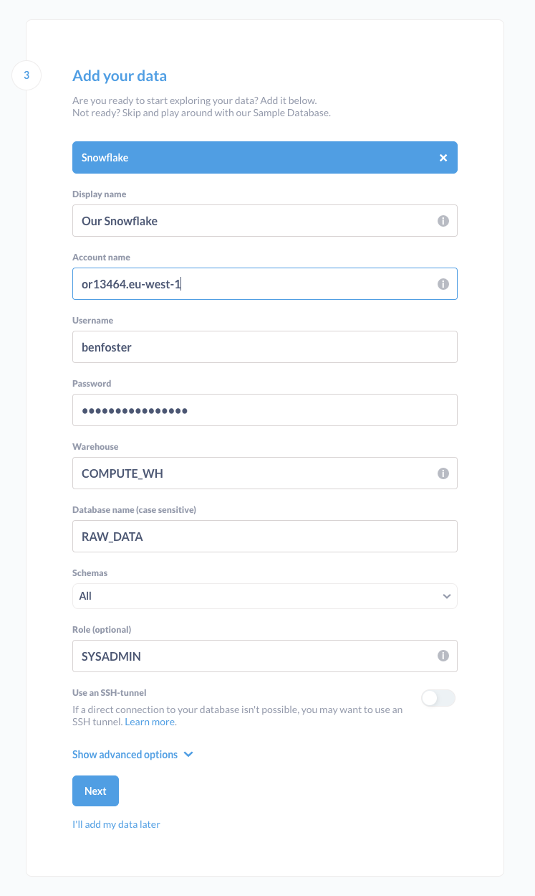
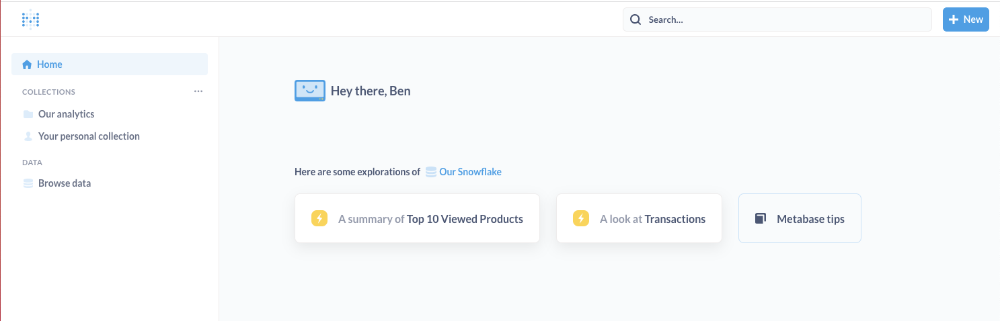

# Connecting analytics dashboards

For this section, you will require docker.

One of the most powerful uses of a data warehouse is to give others the ability to go fish for themselves. We want to empower people to run their own analysis and create reports, rather than relying on engineers to make these things.

As a simple 'up and running' example, we will use Docker to run a dashboard which is accessible from our localhost in browser.

In this example we will use Metabase; it is a simple, open source analytics platform which can be run out of a container. If you wish to productionize it, you can use services like AWS Elastic Beanstalk.

Follow the instructions on the Metabase page [here](https://www.metabase.com/docs/latest/operations-guide/running-metabase-on-docker.html).

By and large all you need to do is run the following command which will pull and load the image:

    docker run -d -p 3000:3000 --name metabase metabase/metabase

Then once it has instantiated, open your browser and enter:

     localhost:3000

 The following show the expected steps to create an account and run a query:

 

 

 

 

 

 

 

 Run a query:

      SELECT FLATTENED_DATA.VALUE:PRODUCT_ID::VARCHAR AS PRODUCT_ID,
          SUM(1) AS FREQUENCY
      FROM RAW_DATA.SALES.TRANSACTIONS AS TRANSACTIONS,
          LATERAL FLATTEN(input => TRANSACTIONS.PAYLOAD, path => 'PRODUCTS_VIEWED') AS FLATTENED_DATA
      GROUP BY FLATTENED_DATA.VALUE:PRODUCT_ID
      ORDER BY FREQUENCY DESC
      
 

 
