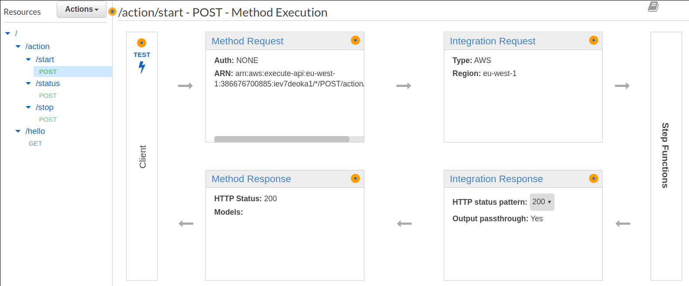
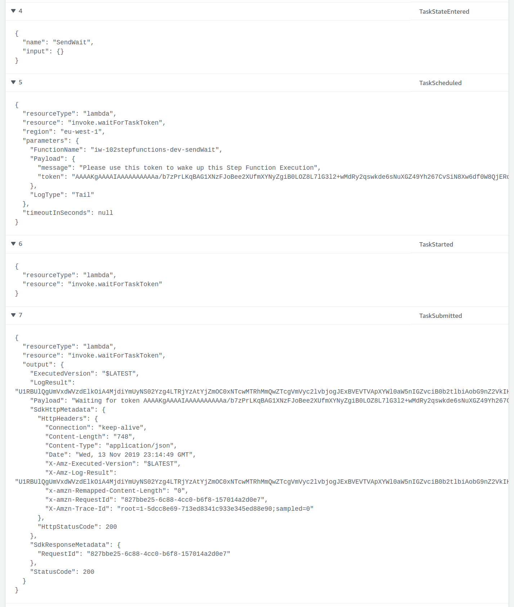
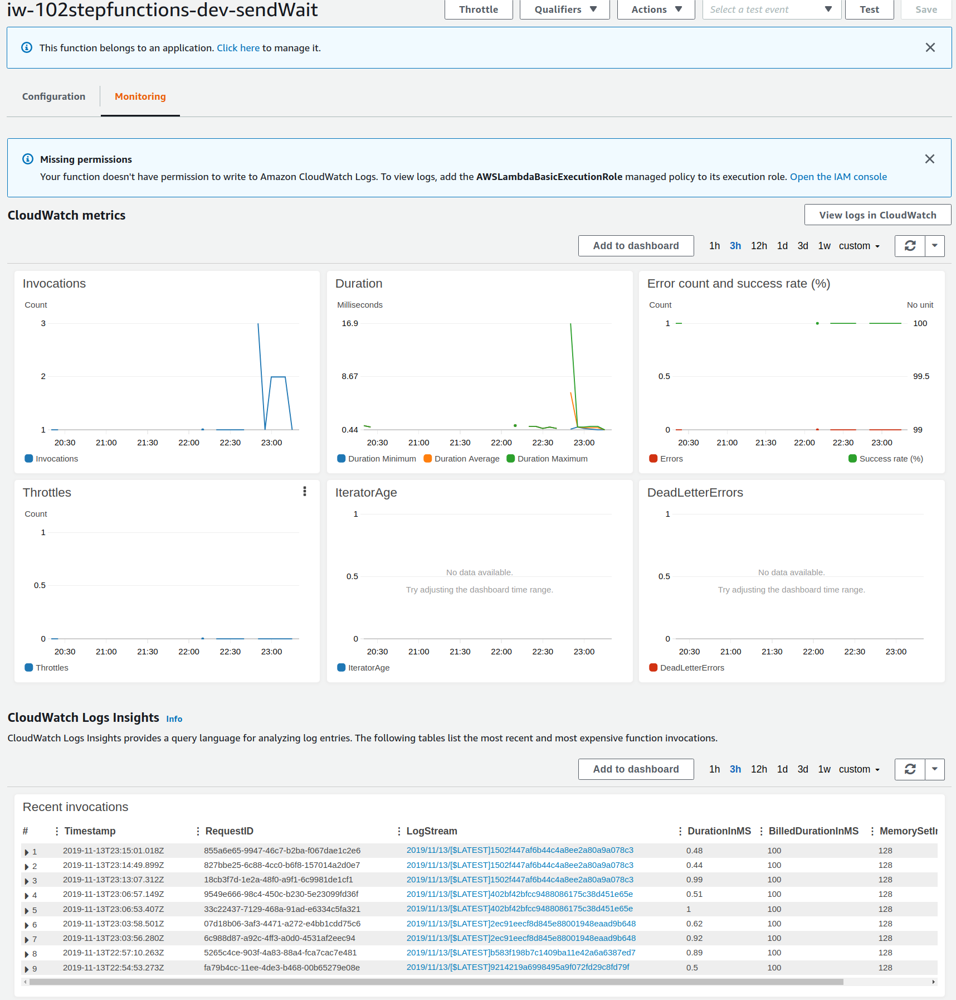
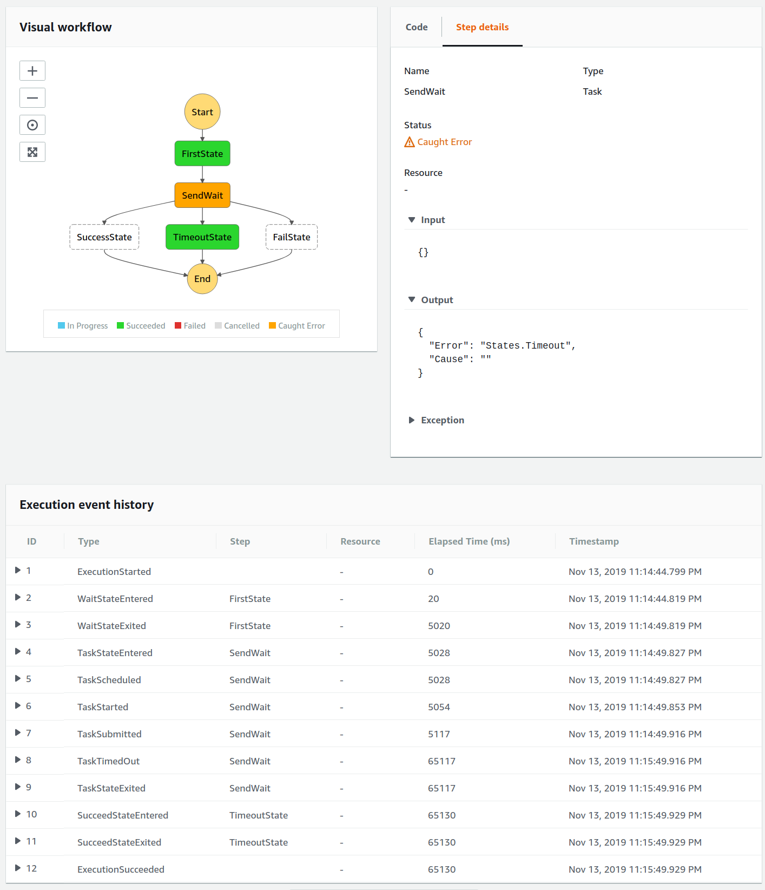
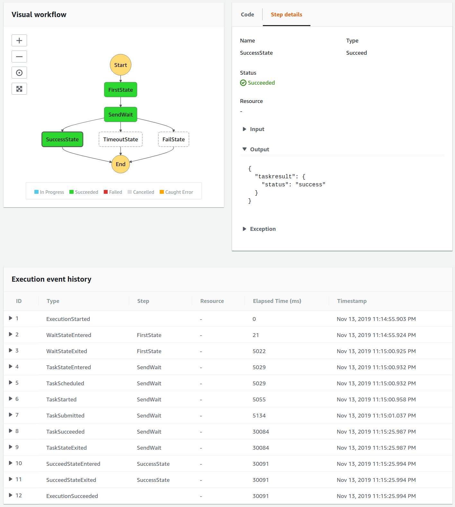
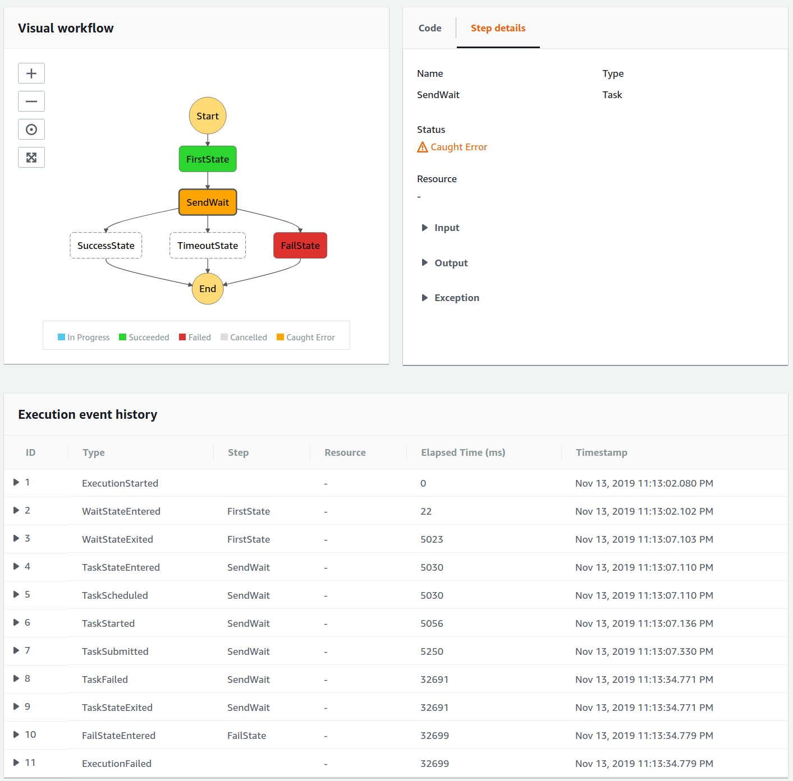
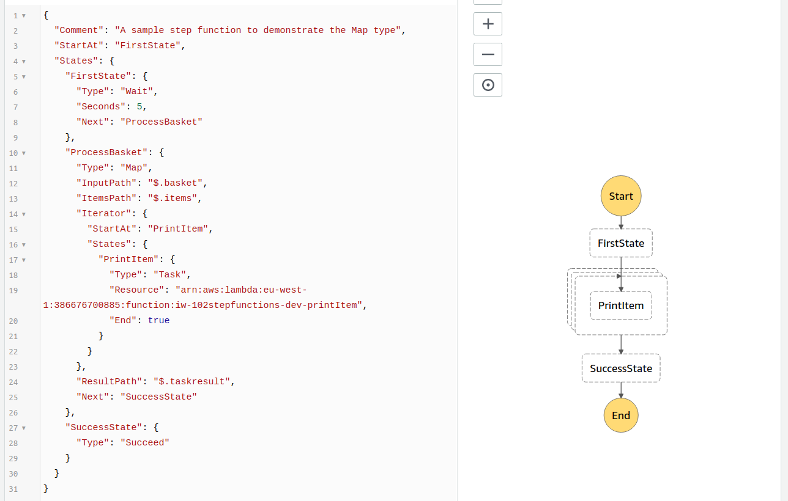
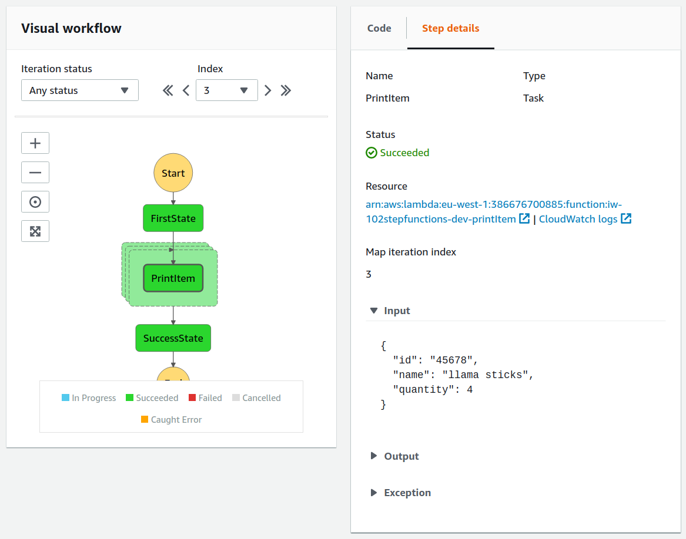
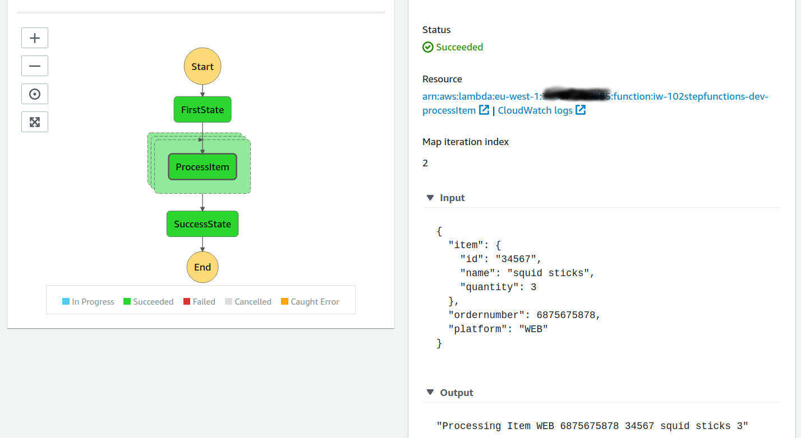
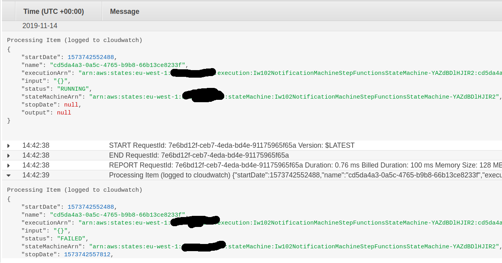

# 102 Step Functions - Infinity Works 

This is the 2nd part of the Step Functions course.
You will need to setup the project by following the setup in the [101 README](../101/README.md)

## Outline

* First Step Machine : iw102StarterMachine
* Add APIs to Step Machine : iw102StarterMachine
* More secure API : iw102StarterMachine
* Callback State Machine : iw102CallbackMachine
* Dynamic parallel processing with Map : iw102MapMachine
* Map Features : iw102MapMachine
* CloudWatch Notifications : iw101NotificationMachine

### Location of this checked out code

Because this is a go project, it must be checked out (or linked) within your go/src directory.

Copy or Link this project to

`~/go/src/github.com/102-step-functions/`

How to Link it

```bash
mkdir -p ~/go/src/github.com/
mkdir ~/code
cd ~/code
git clone git@github.com:infinityworks/101-Sessions.git
cd ~/go/src/github.com
ln -s ~/code/101-Sessions/sessions/StepFunctions-100/102 102-step-functions
```

## Tooling

Some examples in here require you to have the command line util `openssl`

_Linux Install_

```bash
sudo apt install openssl
```

_Windows Install_

<https://wiki.openssl.org/index.php/Binaries>


_OSX Install_
```bash
brew update
brew install openssl
echo 'export PATH="/usr/local/opt/openssl/bin:$PATH"' >> ~/.bash_profile
source ~/.bash_profile
```

We use this to make `HTTPS` requests out to `API GATEWAY`

First we open the connection

```bash
openssl s_client google.com:443
```

Send a Request

```bash
GET / HTTP/1.1
host: google.com
connection: close

```


## First Step Machine : iw102StarterMachine

Copy the contents of the file : see [./saved-steps/serverless-01-starter.yml](./saved-steps/serverless-01-starter.yml) over the `./serverless.yml` file.

Now we deploy the step function:

```bash
npm install
make deploy STAGE=dev
```

> You can Invoke a step function from the CLI

```bash
sls invoke stepf --name iw102StarterMachine --data '{"thekey":"thevalue"}'
```

This runs the stepfunction synchronously 

```bash
{ executionArn: 'arn:aws:states:eu-west-1:000000000000:execution:Iw102StarterMachineStepFunctionsStateMachine-C8ZYXzFB9SCO:0e0eac81-ce53-4db5-aa86-86e92efdeed7',
  stateMachineArn: 'arn:aws:states:eu-west-1:000000000000:stateMachine:Iw102StarterMachineStepFunctionsStateMachine-C8ZYXzFB9SCO',
  name: '0e0eac81-ce53-4db5-aa86-86e92efdeed7',
  status: 'SUCCEEDED',
  startDate: 2019-11-12T11:39:26.081Z,
  stopDate: 2019-11-12T11:39:36.397Z,
  input: '{"thekey":"thevalue"}',
  output: '{"thekey":"thevalue","taskresult":"Hello 102 Class"}' }
```

## Add APIs to Step Machine : iw102StarterMachine

Next we are going to expose an API to allow Step Machines to be started / stopped / described.

Copy the contents of the file : see [./saved-steps/serverless-02-api.yml](./saved-steps/serverless-02-api.yml) over the `./serverless.yml` file.

This actually creates an `API Gateway` deployment.

The `events:` block contains the endpoints you wish to expose.

```yml
stepFunctions:
  stateMachines:
    iw102StarterMachine:
      events:
        - http:
            path: hello
            method: GET
        - http:
            path: action/start
            method: POST
        - http:
            path: action/status
            method: POST
            action: DescribeExecution
        - http:
            path: action/stop
            method: POST
            action: StopExecution
      definition:
```

Run out the changes

```bash
make deploy STAGE=dev
```

We can see that api endpoints get created

```yml
Serverless StepFunctions Outputs
endpoints:
  GET - https://iev7deoka1.execute-api.eu-west-1.amazonaws.com/dev/hello
  POST - https://iev7deoka1.execute-api.eu-west-1.amazonaws.com/dev/action/start
  POST - https://iev7deoka1.execute-api.eu-west-1.amazonaws.com/dev/action/status
  POST - https://iev7deoka1.execute-api.eu-west-1.amazonaws.com/dev/action/stop
```

These can be seen in the console <https://eu-west-1.console.aws.amazon.com/apigateway/home?region=eu-west-1>



You can click `Test` and send a Request Body


This will `asynchronosly` start a step function execution, you can view them at <https://eu-west-1.console.aws.amazon.com/states/home?region=eu-west-1#/statemachines>

You can also use the `DescribeExecution` integration endpoint to see the progress of an execution

Click `Test` and enter a Request Body

```json
{
   "executionArn": "arn:aws:states:eu-west-1:0000000000:execution:Iw102StarterMachineStepFunctionsStateMachine-C8ZYXzFB9SCO:8ff3bddb-4864-4881-943e-2f0055120652"
}
```

This gives this kind of output

```json
{
  "executionArn": "arn:aws:states:eu-west-1:0000000000:execution:Iw102StarterMachineStepFunctionsStateMachine-C8ZYXzFB9SCO:8ff3bddb-4864-4881-943e-2f0055120652",
  "input": "{\"test1\":\"test2\"}",
  "name": "8ff3bddb-4864-4881-943e-2f0055120652",
  "output": "{\"test1\":\"test2\",\"taskresult\":\"Hello 102 Class\"}",
  "startDate": 1573568204.569,
  "stateMachineArn": "arn:aws:states:eu-west-1:00000000000:stateMachine:Iw102StarterMachineStepFunctionsStateMachine-C8ZYXzFB9SCO",
  "status": "SUCCEEDED",
  "stopDate": 1573568214.936
}
```

However we have just exposed an endpoint to the world that anyone can use!

Lets secure it.

## More secure API : iw102StarterMachine

Now lets introduce some keys and usage plans, also note the `private: true` on each event

```yml
provider:
  name: aws
  runtime: go1.x
  stage: dev
  region: eu-west-1
  profile: 101profile
  versionFunctions: false
  apiKeys:
    - ${opt:stage, self:provider.stage}-myFirstKey
  usagePlan:
    quota:
      limit: 5000
      offset: 2
      period: MONTH
    throttle:
      burstLimit: 200
      rateLimit: 100

stepFunctions:
  stateMachines:
    iw102StarterMachine:
      events:
        - http:
            path: hello
            method: GET
            private: true
```

Copy the contents of the file : see [./saved-steps/serverless-03-api-keys.yml](./saved-steps/serverless-03-api-keys.yml) over the `./serverless.yml` file.

And deploy

```bash
make deploy STAGE=dev
```

Now we can see that the output generates a key that is needed to call the service, this key is shown each time and only get generated once.

>You can hide the key from the output with the switch ` --conceal`

```bash
Serverless: Stack update finished...
Service Information
service: iw-102stepfunctions
stage: dev
region: eu-west-1
stack: iw-102stepfunctions-dev
api keys:
  dev-myFirstKey: s1HR9a43llolcatslikeiamdoingthat7YEIvns8
endpoints:
functions:
  hello: iw-102stepfunctions-dev-hello
layers:
  None
```

>The key is also visible in the Web Console <https://eu-west-1.console.aws.amazon.com/apigateway/home?region=eu-west-1#/api-keys/>


You can now see that the API calls require keys, if you try without you get 

```json
{"message":"Forbidden"}
```

Test it - open an ssl connection

```bash
openssl s_client llb348ist9.execute-api.eu-west-1.amazonaws.com:443
```

Send a Request

```bash
GET /dev/hello HTTP/1.1
host: llb348ist9.execute-api.eu-west-1.amazonaws.com
X-API-Key: s1HR9a43llolcatslikeiamdoingthat7YEIvns8
connection: close
```

Get a Response!

```bash
HTTP/1.1 200 OK
Content-Type: application/json
Content-Length: 190
Connection: close
Date: Tue, 12 Nov 2019 15:40:09 GMT
x-amzn-RequestId: 9c3d8aab-83bf-4542-8256-36c9f42b6b01
x-amz-apigw-id: DDXN9HNcDoEF8oA=
X-Amzn-Trace-Id: Root=1-5dcad259-760ded2caa731b642837fea4
X-Cache: Miss from cloudfront
Via: 1.1 f79355bad214d64e02ae8e84a86f4933.cloudfront.net (CloudFront)
X-Amz-Cf-Pop: LHR61-C2
X-Amz-Cf-Id: 6N0AqES_u1GsNM4dzd5ZHITISEfqxCjX2qoVgCw6nwYTjnz5ZTZHiA==

{"executionArn":"arn:aws:states:eu-west-1:386676700885:execution:Iw102StarterMachineStepFunctionsStateMachine-YBD4dm89PhcK:9c3d8aab-83bf-4542-8256-36c9f42b6b01","startDate":1.573573209347E9}closed
```

## Callback State Machine : iw102CallbackMachine

This step machine will stop, generate a wake-up token, and then wait for an external task to use the token to :

* Send a `Success`
* Send a `Failure`
* Send a `Heartbeat`*

> *if you don't set a `HeartbeatSeconds:` then the step function will wait for the whole year

The Task is a special one that can be used to push a message with the token to any of the following services (see <https://github.com/awsdocs/aws-step-functions-developer-guide/blob/master/doc_source/concepts-service-integrations.md>)

* AWS Lambda
* AWS Batch
* AWS ECS/Fargate
* SNS
* SQS
* Step Functions!

In this example we call a `Lambda` named `sendWait` to tell it the token to wake us up with.

In a longer example we could Email or SMS this out to a customer as a one-use URL.

```yml
          SendWait:
            Type: Task
            Resource: "arn:aws:states:::lambda:invoke.waitForTaskToken"
            HeartbeatSeconds: 60
            Parameters:
              FunctionName: iw-102stepfunctions-${opt:stage, self:provider.stage}-sendWait
              Payload: 
                message: "Please use this token to wake up this Step Function Execution"
                token.$: "$$.Task.Token"
            Catch:
            - ErrorEquals:
              - States.Timeout
              Next : TimeoutState
            - ErrorEquals:
              - States.TaskFailed
              Next : FailState
            Next: SuccessState
            ResultPath: "$.taskresult"
```

Lets deploy this out.

Copy the contents of the file : see [./saved-steps/serverless-04-callback.yml](./saved-steps/serverless-04-callback.yml) over the `./serverless.yml` file.

And deploy

```bash
make deploy STAGE=dev
```

You should see the new state machine <https://eu-west-1.console.aws.amazon.com/states/home?region=eu-west-1#/statemachines>

> Note that the `GET` API call has moved to share the context with the `POST` API at `/action/start`


Once one of these is waiting the result can be :

* Success
* Timeout
* Failure

We can now hit the API to start one of the executions

```bash
openssl s_client llb348ist9.execute-api.eu-west-1.amazonaws.com:443
```

Then paste in
> Note you need to have 2 returns after the `close`

```bash
GET /dev/action/start HTTP/1.1
host: llb348ist9.execute-api.eu-west-1.amazonaws.com
X-API-Key: s1HR9a43llolcatslikeiamdoingthat7YEIvns8
connection: close

```

An Execution should now be running, and if you look at the execution, you should see the Token getting passed to the Lambda



If you see the `sendWait Lambda` <https://eu-west-1.console.aws.amazon.com/lambda/home?region=eu-west-1#/functions/iw-102stepfunctions-dev-sendWait?> it recieves the token and writes it to log (Cloudwatch)



```go
package main

import (
	"context"
	"fmt"

	"github.com/aws/aws-lambda-go/lambda"
)

// WaitEvent an event to make the token accessible
type WaitEvent struct {
	Token string `json:"token"`
}

// HandleRequest the method that recieves the step call
func HandleRequest(ctx context.Context, waitEvent WaitEvent) (string, error) {
	fmt.Printf("Waiting for token (logged to cloudwatch) %v", waitEvent.Token)
	// This could email out this token as a URL to click on in an Email.
	return fmt.Sprintf("Waiting for token %v", waitEvent.Token), nil
}

func main() {
	lambda.Start(HandleRequest)
}
```

You can click in the `Monitoring` tab in the Lambda and then click the `View logs in CloudWatch` button.

If you pick the newest logstream, you can see the Lambda printing out the token.


By now this execution will  have `timed out`, in our state machine this is caught and treated as a `SUCCESS`

```yml
            Catch:
            - ErrorEquals:
              - States.Timeout
              Next : TimeoutState
```




However `when the execution is waiting for a callback`, we can hit the AWS API with

* send-task-success
* send-task-failure
* send-task-heartbeat

First lets set our timeout to be `5 minutes`, to give ourselves more time to work

```yaml
          SendWait:
            Type: Task
            Resource: "arn:aws:states:::lambda:invoke.waitForTaskToken"
            HeartbeatSeconds: 300
            Parameters:
```

And re-deploy

```bash
make deploy STAGE=dev
```

Great, now lets start another execution

```bash
openssl s_client llb348ist9.execute-api.eu-west-1.amazonaws.com:443
```

Then paste in

```bash
GET /dev/action/start HTTP/1.1
host: llb348ist9.execute-api.eu-west-1.amazonaws.com
X-API-Key: s1HR9a43llolcatslikeiamdoingthat7YEIvns8
connection: close

```

Ok we need to grab the `token` from either the `step machine execution` or the `lambda log`

Then we export is as `${token}` variable in our shell

```bash
export token=AAAAKgAAAAIAAAAAAAAAAXH1adiaFSjaEB5xg48ruVvjRhI3yJ7Hxnitg8FAVFxDblKIDE6ql4ZsRru+zCDMGFCM5qHefmQXfK2m6lsqzuIU4EUa7iuqxuLYzyA2LBJTUlAClKFSXqbzmsdNP8uS8M1NMp1V82sp4VvigJ1iAA8m+36L1InskdR/vFGP1pSXn1vgO4EjlniCc9ATFQc3F+0rWi0/GCpQ8TK20+CitVv8uIPxccA/H3K5uk690bfBX0fOkf/ecIztIGXo0jhw/inEHrt7lenV0i1eYZX5OXQpqw/lPxW3KKDYNa3mOMBzd4GJwi7gWKvGiI4tr8inzDoSl7Arp4FfXvAjSuEM+qYUlu5VhmoWYUq0SG2Nsy+AzmZo/CD+O94LgutB/bH6Fiys3Jbk0aT8vQ8PAjm8DhmlXGNFyJJMX00p2kyK35CV+F932ViSE7vXXKz7PZsVqBdpUG+oDM1Ue4poSG6hBAT2I8EevcKddqbu921OhimYZLDGFTgq/ykvMpoyHMVwQBAVqzPuEGw2QCRGhUBU3YEj06tze8RR1p0fo4VcwLC+51P7n94XlonuqlKFxVVVtJJzw7hDbnAPm6qmc+NKG0AIIIwrAvc+Po2fqB9gqieNjI5DoGt43EXvI9UaeHL0s6AGCvXsHMe4QtM73O9ByEacMEYY5w6B7qk59ivte0Gv3VuwDjd1qkTg3WqjXnxLNg==
```

Now we can use the `awscli` to send the callback events

This command sends a `heartbeat`, which will re-set the timeout back to `300 seconds`

```bash
aws stepfunctions send-task-heartbeat --task-token $token --profile 101profile --region eu-west-1
```

Ok lets make this execution `succeed`, and use this command

```bash
aws stepfunctions send-task-success --task-token $token --task-output '{"status": "success"}' --profile 101profile --region eu-west-1
```



```bash
aws stepfunctions send-task-failure --task-token $token --profile 101profile --region eu-west-1
```

Now lets start another execution to test `FAILURES`

> Note : Your `host` & `x-api-key` will be different - update it in the 3 places

```bash
openssl s_client llb348ist9.execute-api.eu-west-1.amazonaws.com:443
```

Then paste in

```bash
GET /dev/action/start HTTP/1.1
host: llb348ist9.execute-api.eu-west-1.amazonaws.com
X-API-Key: s1HR9a43llolcatslikeiamdoingthat7YEIvns8
connection: close

```

Now we must get the `${token}` again and export it

```bash
export token=AAAAKgAAAAIAAAAAAAAAAXH1adiaFSjaEB5xg48ruVvjRhI3yJ7Hxnitg8FAVFxDblKIDE6ql4ZsRru+zCDMGFCM5qHefmQXfK2m6lsqzuIU4EUa7iuqxuLYzyA2LBJTUlAClKFSXqbzmsdNP8uS8M1NMp1V82sp4VvigJ1iAA8m+36L1InskdR/vFGP1pSXn1vgO4EjlniCc9ATFQc3F+0rWi0/GCpQ8TK20+CitVv8uIPxccA/H3K5uk690bfBX0fOkf/ecIztIGXo0jhw/inEHrt7lenV0i1eYZX5OXQpqw/lPxW3KKDYNa3mOMBzd4GJwi7gWKvGiI4tr8inzDoSl7Arp4FfXvAjSuEM+qYUlu5VhmoWYUq0SG2Nsy+AzmZo/CD+O94LgutB/bH6Fiys3Jbk0aT8vQ8PAjm8DhmlXGNFyJJMX00p2kyK35CV+F932ViSE7vXXKz7PZsVqBdpUG+oDM1Ue4poSG6hBAT2I8EevcKddqbu921OhimYZLDGFTgq/ykvMpoyHMVwQBAVqzPuEGw2QCRGhUBU3YEj06tze8RR1p0fo4VcwLC+51P7n94XlonuqlKFxVVVtJJzw7hDbnAPm6qmc+NKG0AIIIwrAvc+Po2fqB9gqieNjI5DoGt43EXvI9UaeHL0s6AGCvXsHMe4QtM73O9ByEacMEYY5w6B7qk59ivte0Gv3VuwDjd1qkTg3WqjXnxLNg==
```

And now we can force this one to `Fail`

```bash
aws stepfunctions send-task-heartbeat --task-token $token --profile 101profile --region eu-west-1
```



## Dynamic parallel processing with Map : iw102MapMachine

Assuming we have input that contains an Array of Items, then a Map is a great way to dynamically process each item in a step funtion.

> Here we have a `Basket` containing an array of `Items`

```json
{
  "customer": "54632976324324324",
  "basket": {
    "platform": "WEB",
    "items": [
      { "id": "12345", "name": "fish sticks", "quantity": 1 },
      { "id": "23456", "name": "cheese sticks", "quantity": 2 },
      { "id": "34567", "name": "squid sticks", "quantity": 3 },
      { "id": "45678", "name": "llama sticks", "quantity": 4 },
      { "id": "56789", "name": "turkey sticks", "quantity": 5 }
    ]
  }
}
```

The `Type: Map` can be seen here, we pass in the `InputPath` to the items and then `ItemsPath`.

There can be `multiple steps` within the Iterator, including cnaything that you can do in a step function however in this example we just have 1 step.

```yml
          ProcessBasket:
            Type: Map
            InputPath: "$.basket"
            ItemsPath: "$.items"
            Iterator:
              StartAt: PrintItem
              States:
                PrintItem:
                  Type: Task
                  Resource:
                    Fn::GetAtt: [printItem, Arn]
                  End: true
            ResultPath: "$.taskresult"
            Next: SuccessState
```

Copy the contents of the file : see [./saved-steps/serverless-05-map.yml](./saved-steps/serverless-05-map.yml) over the `./serverless.yml` file.

Then deploy

```bash
make deploy STAGE=dev
```

The `Map` type can be seen if you `Edit` the state machine <https://eu-west-1.console.aws.amazon.com/states/home?region=eu-west-1#/statemachines>




Great, lets start one, for simplicity lets do it in the `Web Console`, click `Start Execution` and add this payload:

```json
{
  "customer": "54632976324324324",
  "basket": {
    "platform": "WEB",
    "items": [
      { "id": "12345", "name": "fish sticks", "quantity": 1 },
      { "id": "23456", "name": "cheese sticks", "quantity": 2 },
      { "id": "34567", "name": "squid sticks", "quantity": 3 },
      { "id": "45678", "name": "llama sticks", "quantity": 4 },
      { "id": "56789", "name": "turkey sticks", "quantity": 5 }
    ]
  }
}
```

Here we can see each Lambda gets in input of each row

```json
{
  "id": "45678",
  "name": "llama sticks",
  "quantity": 4
}
```



and the output is a line of text `"Processing Item 45678 llama sticks 4"`

These are added to the state in an array in `"taskresult": []`

```json
{
  "customer": "54632976324324324",
  "basket": {
    "platform": "WEB",
    "items": [
      {
        "id": "12345",
        "name": "fish sticks",
        "quantity": 1
      },
      {
        "id": "23456",
        "name": "cheese sticks",
        "quantity": 2
      },
      {
        "id": "34567",
        "name": "squid sticks",
        "quantity": 3
      },
      {
        "id": "45678",
        "name": "llama sticks",
        "quantity": 4
      },
      {
        "id": "56789",
        "name": "turkey sticks",
        "quantity": 5
      }
    ]
  },
  "taskresult": [
    "Processing Item 12345 fish sticks 1",
    "Processing Item 23456 cheese sticks 2",
    "Processing Item 34567 squid sticks 3",
    "Processing Item 45678 llama sticks 4",
    "Processing Item 56789 turkey sticks 5"
  ]
}
```

## Map Features : iw102MapMachine

In this example we want fields that are outside of the array to be included in each lambda call, consider this input

```json
{
  "customer": "54632976324324324",
  "basket": {
    "platform": "WEB",
    "ordernumber": 6875675878,
    "items": [
      { "id": "12345", "name": "fish sticks", "quantity": 1 },
      { "id": "23456", "name": "cheese sticks", "quantity": 2 },
      { "id": "34567", "name": "squid sticks", "quantity": 3 },
      { "id": "45678", "name": "llama sticks", "quantity": 4 },
      { "id": "56789", "name": "turkey sticks", "quantity": 5 }
    ]
  }
}
```

We want the following to be passed to each lambda

```json
{
  "item": {
    "id": "34567",
    "name": "squid sticks",
    "quantity": 3
  },
  "ordernumber": 6875675878,
  "platform": "WEB"
}
```

The `Parameters:` part defines the structure of the `JSON` that will be passed to the Lambda

> Note : the `MaxConcurrency: 3`  has been set to control how many items get processed concurrently for each execution

```yaml
         ProcessBasket:
            Type: Map
            InputPath: "$.basket"
            ItemsPath: "$.items"
            Parameters:
              "item.$": "$$.Map.Item.Value"
              "platform.$": "$.platform"
              "ordernumber.$": "$.ordernumber"
            MaxConcurrency: 3
            Iterator:
              StartAt: ProcessItem
              States:
                ProcessItem:
                  Type: Task
                  Resource:
                    Fn::GetAtt: [processItem, Arn]
                  End: true
            ResultPath: "$.taskresult"
            Next: SuccessState
```

Copy the contents of the file : see [./saved-steps/serverless-06-map.yml](./saved-steps/serverless-06-map.yml) over the `./serverless.yml` file.

Then deploy

```bash
make deploy STAGE=dev
```

Now lets start a `new execution` with a similar payload as the previous example

```json
{
  "customer": "54632976324324324",
  "basket": {
    "platform": "WEB",
    "ordernumber": 6875675878,
    "items": [
      { "id": "12345", "name": "fish sticks", "quantity": 1 },
      { "id": "23456", "name": "cheese sticks", "quantity": 2 },
      { "id": "34567", "name": "squid sticks", "quantity": 3 },
      { "id": "45678", "name": "llama sticks", "quantity": 4 },
      { "id": "56789", "name": "turkey sticks", "quantity": 5 }
    ]
  }
}
```

The new Lambda `processItem` parses the request to a structure


```go
// Item an event to hold an Item
type Item struct {
	ID       string `json:"id"`
	Name     string `json:"name"`
	Quantity int    `json:"quantity"`
}

// ItemEvent an event to hold the whole object
type ItemEvent struct {
	Item        Item
	Platform    string `json:"platform"`
	Ordernumber int    `json:"ordernumber"`
}
```

And now includes data outside of the array in its input and output



So the final output is now

```json
{
  "customer": "54632976324324324",
  "basket": {
    "platform": "WEB",
    "ordernumber": 6875675878,
    "items": [
      {
        "id": "12345",
        "name": "fish sticks",
        "quantity": 1
      },
      {
        "id": "23456",
        "name": "cheese sticks",
        "quantity": 2
      },
      {
        "id": "34567",
        "name": "squid sticks",
        "quantity": 3
      },
      {
        "id": "45678",
        "name": "llama sticks",
        "quantity": 4
      },
      {
        "id": "56789",
        "name": "turkey sticks",
        "quantity": 5
      }
    ]
  },
  "taskresult": [
    "Processing Item WEB 6875675878 12345 fish sticks 1",
    "Processing Item WEB 6875675878 23456 cheese sticks 2",
    "Processing Item WEB 6875675878 34567 squid sticks 3",
    "Processing Item WEB 6875675878 45678 llama sticks 4",
    "Processing Item WEB 6875675878 56789 turkey sticks 5"
  ]
}
```

## CloudWatch Notifications : iw101NotificationMachine

You can monitor the execution state of your state machines via CloudWatch Events. It allows you to be alerted when the status of your state machine changes to `ABORTED`, `FAILED`, `RUNNING`, `SUCCEEDED` or `TIMED_OUT`.

These notifications can be passed to a number of AWS Services

* SNS
* SQS
* LAMBDA
* KINESIS / FIREHOSE
* STEP FUNCTIONS

Here are some examples

```yml
stepFunctions:
  stateMachines:
    hellostepfunc1:
      name: test
      definition:
        ...
      notifications:
        ABORTED:
          - sns: SNS_TOPIC_ARN
          - sqs: SQS_TOPIC_ARN
          - sqs: # for FIFO queues, which requires you to configure the message group ID
              arn: SQS_TOPIC_ARN
              messageGroupId: 12345
          - lambda: LAMBDA_FUNCTION_ARN
          - kinesis: KINESIS_STREAM_ARN
          - kinesis:
               arn: KINESIS_STREAM_ARN
               partitionKeyPath: $.id # used to choose the parition key from payload
          - firehose: FIREHOSE_STREAM_ARN
          - stepFunctions: STATE_MACHINE_ARN
        FAILED:
```

We howwver will just use a simple `lambda` example - and use the same lambda for all notifictaions

> Note the strange way we need to Refer to the name of the Lambda, this I looked up in the generated .serverless files

```yml
      notifications:
        ABORTED: 
          - lambda: !GetAtt MonitorLambdaFunction.Arn
        FAILED:
          - lambda: !GetAtt MonitorLambdaFunction.Arn
        RUNNING:
          - lambda: !GetAtt MonitorLambdaFunction.Arn
        SUCCEEDED:
          - lambda: !GetAtt MonitorLambdaFunction.Arn
```

Copy the contents of the file : see [./saved-steps/serverless-07-notification.yml](./saved-steps/serverless-07-notification.yml) over the `./serverless.yml` file.

Then deploy

```bash
make deploy STAGE=dev
```

we should now lets start an execution

```bash
openssl s_client llb348ist9.execute-api.eu-west-1.amazonaws.com:443
```

Then paste in

```bash
GET /dev/action/start HTTP/1.1
host: llb348ist9.execute-api.eu-west-1.amazonaws.com
X-API-Key: s1HR9a43llolcatslikeiamdoingthat7YEIvns8
connection: close

```

As each event gets fired, the `monitor lambda` will get called <https://eu-west-1.console.aws.amazon.com/lambda/home?region=eu-west-1#/functions/iw-102stepfunctions-dev-monitor>

This lambda simply writes out to cloudwatch.

```go
// HandleRequest the method that recieves the step call
func HandleRequest(ctx context.Context, cwEvent events.CloudWatchEvent) (string, error) {
	fmt.Printf("Processing Item (logged to cloudwatch) %v ", string(cwEvent.Detail))
	return fmt.Sprintf("Processing Item %v ", string(cwEvent.Detail)), nil
}
```

If you view the `Monitoring` tab, and click `view logs in CloudWatch` and choose the latest Log Stream; you can see the lambda recieving the events.




## Clean Up

This will un-deploy all the resources being used in AWS

```bash
sls remove -STAGE=DEV
```

## More Reading

<https://github.com/awsdocs/aws-step-functions-developer-guide/blob/master/doc_source/connect-lambda.md>

<https://docs.aws.amazon.com/step-functions/latest/dg/input-output-contextobject.html>

<https://docs.aws.amazon.com/step-functions/latest/dg/connect-to-resource.html#connect-wait-token>

<http://wrschneider.github.io/2019/06/20/step-function-callbacks.html>

<https://docs.aws.amazon.com/step-functions/latest/dg/amazon-states-language-map-state.html>

<https://docs.aws.amazon.com/step-functions/latest/dg/sample-map-state.html>

<https://docs.aws.amazon.com/lambda/latest/dg/go-programming-model-logging.html>

<https://docs.aws.amazon.com/step-functions/latest/dg/welcome.html>

<https://serverless.com/plugins/serverless-step-functions/>